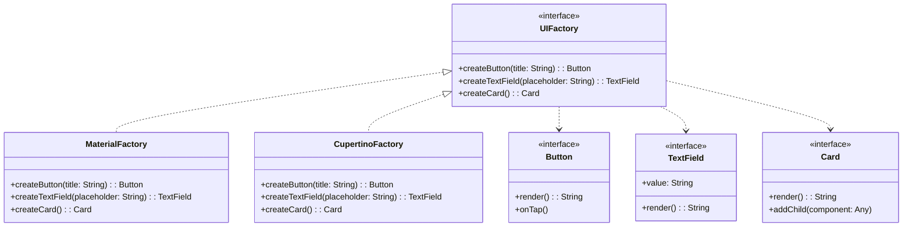

# Abstract Factory Pattern

## Intent

Provide an interface for creating families of related or dependent objects without specifying their concrete classes. In mobile development, this is invaluable for creating platform-consistent UI component families or themed widget sets.

## Problem

When building cross-platform mobile applications or apps with multiple themes, you need to create groups of related objects that work together. For example, a design system might have buttons, text fields, and cards that must all share the same visual style. Creating these objects independently risks mixing components from different families — a Material button with a Cupertino text field.

## Solution

The Abstract Factory pattern groups related factory methods into a single factory interface. Each concrete factory produces a complete family of products that are designed to work together. Client code uses the abstract factory interface and never deals with concrete product classes directly.

## UML Diagram



## Swift Implementation

```swift
import Foundation

// MARK: - Abstract Products

protocol Button {
    var title: String { get }
    func render() -> String
    func onTap(action: () -> Void)
}

protocol TextField {
    var placeholder: String { get }
    var text: String { get set }
    func render() -> String
}

protocol Card {
    var cornerRadius: Double { get }
    var elevation: Double { get }
    func render() -> String
}

protocol Toggle {
    var isOn: Bool { get set }
    func render() -> String
}

// MARK: - Material Products

struct MaterialButton: Button {
    let title: String
    let elevation: Double = 2.0
    let backgroundColor: String = "#6200EE"

    func render() -> String {
        return """
        <MaterialButton
          elevation=\(elevation)
          color="\(backgroundColor)"
          text="\(title)"
        />
        """
    }

    func onTap(action: () -> Void) {
        print("Material ripple effect triggered")
        action()
    }
}

struct MaterialTextField: TextField {
    let placeholder: String
    var text: String = ""
    let underlineColor: String = "#6200EE"

    func render() -> String {
        return """
        <MaterialTextField
          hint="\(placeholder)"
          underlineColor="\(underlineColor)"
          value="\(text)"
        />
        """
    }
}

struct MaterialCard: Card {
    let cornerRadius: Double = 4.0
    let elevation: Double = 2.0

    func render() -> String {
        return """
        <MaterialCard
          cornerRadius=\(cornerRadius)
          elevation=\(elevation)
        />
        """
    }
}

struct MaterialToggle: Toggle {
    var isOn: Bool = false
    let trackColor: String = "#6200EE"

    func render() -> String {
        return """
        <MaterialSwitch
          checked=\(isOn)
          trackColor="\(trackColor)"
        />
        """
    }
}

// MARK: - Cupertino Products

struct CupertinoButton: Button {
    let title: String
    let tintColor: String = "#007AFF"

    func render() -> String {
        return """
        <CupertinoButton
          tintColor="\(tintColor)"
          text="\(title)"
        />
        """
    }

    func onTap(action: () -> Void) {
        print("Cupertino highlight effect triggered")
        action()
    }
}

struct CupertinoTextField: TextField {
    let placeholder: String
    var text: String = ""
    let borderStyle: String = "roundedRect"

    func render() -> String {
        return """
        <CupertinoTextField
          placeholder="\(placeholder)"
          borderStyle="\(borderStyle)"
          value="\(text)"
        />
        """
    }
}

struct CupertinoCard: Card {
    let cornerRadius: Double = 10.0
    let elevation: Double = 0.0

    func render() -> String {
        return """
        <CupertinoCard
          cornerRadius=\(cornerRadius)
          shadow="subtle"
        />
        """
    }
}

struct CupertinoToggle: Toggle {
    var isOn: Bool = false
    let onTintColor: String = "#34C759"

    func render() -> String {
        return """
        <CupertinoSwitch
          value=\(isOn)
          onTintColor="\(onTintColor)"
        />
        """
    }
}

// MARK: - Abstract Factory

protocol UIFactory {
    func createButton(title: String) -> Button
    func createTextField(placeholder: String) -> TextField
    func createCard() -> Card
    func createToggle() -> Toggle
}

// MARK: - Concrete Factories

final class MaterialUIFactory: UIFactory {
    func createButton(title: String) -> Button {
        return MaterialButton(title: title)
    }

    func createTextField(placeholder: String) -> TextField {
        return MaterialTextField(placeholder: placeholder)
    }

    func createCard() -> Card {
        return MaterialCard()
    }

    func createToggle() -> Toggle {
        return MaterialToggle()
    }
}

final class CupertinoUIFactory: UIFactory {
    func createButton(title: String) -> Button {
        return CupertinoButton(title: title)
    }

    func createTextField(placeholder: String) -> TextField {
        return CupertinoTextField(placeholder: placeholder)
    }

    func createCard() -> Card {
        return CupertinoCard()
    }

    func createToggle() -> Toggle {
        return CupertinoToggle()
    }
}

// MARK: - Factory Provider

enum Platform {
    case iOS, android
}

func createUIFactory(for platform: Platform) -> UIFactory {
    switch platform {
    case .iOS:
        return CupertinoUIFactory()
    case .android:
        return MaterialUIFactory()
    }
}

// MARK: - Client Code

func buildLoginScreen(using factory: UIFactory) {
    let emailField = factory.createTextField(placeholder: "Email")
    let passwordField = factory.createTextField(placeholder: "Password")
    let loginButton = factory.createButton(title: "Sign In")
    let rememberToggle = factory.createToggle()

    print("Login Screen Components:")
    print(emailField.render())
    print(passwordField.render())
    print(rememberToggle.render())
    print(loginButton.render())
}

// Usage
let factory = createUIFactory(for: .iOS)
buildLoginScreen(using: factory)
```

## Dart Implementation

```dart
// Abstract products
abstract class Button {
  String get title;
  String render();
  void onTap(void Function() action);
}

abstract class TextField {
  String get placeholder;
  String text = '';
  String render();
}

abstract class Card {
  double get cornerRadius;
  double get elevation;
  String render();
}

abstract class Toggle {
  bool isOn = false;
  String render();
}

// Material products
class MaterialButton implements Button {
  @override
  final String title;
  final double elevation;
  final String backgroundColor;

  MaterialButton({
    required this.title,
    this.elevation = 2.0,
    this.backgroundColor = '#6200EE',
  });

  @override
  String render() => '<MaterialButton elevation=$elevation color="$backgroundColor" text="$title" />';

  @override
  void onTap(void Function() action) {
    print('Material ripple effect triggered');
    action();
  }
}

class MaterialTextField implements TextField {
  @override
  final String placeholder;
  @override
  String text;
  final String underlineColor;

  MaterialTextField({
    required this.placeholder,
    this.text = '',
    this.underlineColor = '#6200EE',
  });

  @override
  String render() => '<MaterialTextField hint="$placeholder" underlineColor="$underlineColor" value="$text" />';
}

class MaterialCard implements Card {
  @override
  final double cornerRadius = 4.0;
  @override
  final double elevation = 2.0;

  @override
  String render() => '<MaterialCard cornerRadius=$cornerRadius elevation=$elevation />';
}

class MaterialToggle implements Toggle {
  @override
  bool isOn;
  final String trackColor;

  MaterialToggle({this.isOn = false, this.trackColor = '#6200EE'});

  @override
  String render() => '<MaterialSwitch checked=$isOn trackColor="$trackColor" />';
}

// Cupertino products
class CupertinoButton implements Button {
  @override
  final String title;
  final String tintColor;

  CupertinoButton({required this.title, this.tintColor = '#007AFF'});

  @override
  String render() => '<CupertinoButton tintColor="$tintColor" text="$title" />';

  @override
  void onTap(void Function() action) {
    print('Cupertino highlight effect triggered');
    action();
  }
}

class CupertinoTextField implements TextField {
  @override
  final String placeholder;
  @override
  String text;
  final String borderStyle;

  CupertinoTextField({
    required this.placeholder,
    this.text = '',
    this.borderStyle = 'roundedRect',
  });

  @override
  String render() => '<CupertinoTextField placeholder="$placeholder" borderStyle="$borderStyle" value="$text" />';
}

class CupertinoCard implements Card {
  @override
  final double cornerRadius = 10.0;
  @override
  final double elevation = 0.0;

  @override
  String render() => '<CupertinoCard cornerRadius=$cornerRadius shadow="subtle" />';
}

class CupertinoToggle implements Toggle {
  @override
  bool isOn;
  final String onTintColor;

  CupertinoToggle({this.isOn = false, this.onTintColor = '#34C759'});

  @override
  String render() => '<CupertinoSwitch value=$isOn onTintColor="$onTintColor" />';
}

// Abstract factory
abstract class UIFactory {
  Button createButton({required String title});
  TextField createTextField({required String placeholder});
  Card createCard();
  Toggle createToggle();
}

// Concrete factories
class MaterialUIFactory implements UIFactory {
  @override
  Button createButton({required String title}) => MaterialButton(title: title);

  @override
  TextField createTextField({required String placeholder}) => MaterialTextField(placeholder: placeholder);

  @override
  Card createCard() => MaterialCard();

  @override
  Toggle createToggle() => MaterialToggle();
}

class CupertinoUIFactory implements UIFactory {
  @override
  Button createButton({required String title}) => CupertinoButton(title: title);

  @override
  TextField createTextField({required String placeholder}) => CupertinoTextField(placeholder: placeholder);

  @override
  Card createCard() => CupertinoCard();

  @override
  Toggle createToggle() => CupertinoToggle();
}

enum TargetPlatform { iOS, android }

UIFactory createUIFactory(TargetPlatform platform) {
  switch (platform) {
    case TargetPlatform.iOS:
      return CupertinoUIFactory();
    case TargetPlatform.android:
      return MaterialUIFactory();
  }
}

// Usage
void main() {
  final factory = createUIFactory(TargetPlatform.iOS);

  final emailField = factory.createTextField(placeholder: 'Email');
  final passwordField = factory.createTextField(placeholder: 'Password');
  final loginButton = factory.createButton(title: 'Sign In');
  final rememberToggle = factory.createToggle();

  print('Login Screen:');
  print(emailField.render());
  print(passwordField.render());
  print(rememberToggle.render());
  print(loginButton.render());
}
```

## TypeScript Implementation

```typescript
// Abstract products
interface Button {
  readonly title: string;
  render(): string;
  onTap(action: () => void): void;
}

interface TextField {
  readonly placeholder: string;
  text: string;
  render(): string;
}

interface Card {
  readonly cornerRadius: number;
  readonly elevation: number;
  render(): string;
}

interface Toggle {
  isOn: boolean;
  render(): string;
}

// Material products
class MaterialButton implements Button {
  readonly elevation = 2.0;
  readonly backgroundColor = "#6200EE";

  constructor(public readonly title: string) {}

  render(): string {
    return `<MaterialButton elevation=${this.elevation} color="${this.backgroundColor}" text="${this.title}" />`;
  }

  onTap(action: () => void): void {
    console.log("Material ripple effect triggered");
    action();
  }
}

class MaterialTextField implements TextField {
  text = "";
  readonly underlineColor = "#6200EE";

  constructor(public readonly placeholder: string) {}

  render(): string {
    return `<MaterialTextField hint="${this.placeholder}" underlineColor="${this.underlineColor}" value="${this.text}" />`;
  }
}

class MaterialCard implements Card {
  readonly cornerRadius = 4.0;
  readonly elevation = 2.0;

  render(): string {
    return `<MaterialCard cornerRadius=${this.cornerRadius} elevation=${this.elevation} />`;
  }
}

class MaterialToggle implements Toggle {
  isOn = false;
  readonly trackColor = "#6200EE";

  render(): string {
    return `<MaterialSwitch checked=${this.isOn} trackColor="${this.trackColor}" />`;
  }
}

// Cupertino products
class CupertinoButton implements Button {
  readonly tintColor = "#007AFF";

  constructor(public readonly title: string) {}

  render(): string {
    return `<CupertinoButton tintColor="${this.tintColor}" text="${this.title}" />`;
  }

  onTap(action: () => void): void {
    console.log("Cupertino highlight effect triggered");
    action();
  }
}

class CupertinoTextField implements TextField {
  text = "";
  readonly borderStyle = "roundedRect";

  constructor(public readonly placeholder: string) {}

  render(): string {
    return `<CupertinoTextField placeholder="${this.placeholder}" borderStyle="${this.borderStyle}" value="${this.text}" />`;
  }
}

class CupertinoCard implements Card {
  readonly cornerRadius = 10.0;
  readonly elevation = 0.0;

  render(): string {
    return `<CupertinoCard cornerRadius=${this.cornerRadius} shadow="subtle" />`;
  }
}

class CupertinoToggle implements Toggle {
  isOn = false;
  readonly onTintColor = "#34C759";

  render(): string {
    return `<CupertinoSwitch value=${this.isOn} onTintColor="${this.onTintColor}" />`;
  }
}

// Abstract factory
interface UIFactory {
  createButton(title: string): Button;
  createTextField(placeholder: string): TextField;
  createCard(): Card;
  createToggle(): Toggle;
}

class MaterialUIFactory implements UIFactory {
  createButton(title: string): Button { return new MaterialButton(title); }
  createTextField(placeholder: string): TextField { return new MaterialTextField(placeholder); }
  createCard(): Card { return new MaterialCard(); }
  createToggle(): Toggle { return new MaterialToggle(); }
}

class CupertinoUIFactory implements UIFactory {
  createButton(title: string): Button { return new CupertinoButton(title); }
  createTextField(placeholder: string): TextField { return new CupertinoTextField(placeholder); }
  createCard(): Card { return new CupertinoCard(); }
  createToggle(): Toggle { return new CupertinoToggle(); }
}

type Platform = "ios" | "android";

function createUIFactory(platform: Platform): UIFactory {
  return platform === "ios" ? new CupertinoUIFactory() : new MaterialUIFactory();
}

// Usage
const factory = createUIFactory("ios");
const emailField = factory.createTextField("Email");
const loginButton = factory.createButton("Sign In");
console.log(emailField.render());
console.log(loginButton.render());
```

## When to Use

| Scenario | Abstract Factory? | Reason |
|----------|------------------|--------|
| Cross-platform UI components | ✅ | Consistent Material/Cupertino families |
| Themed widget sets | ✅ | Light/dark theme component families |
| Multi-brand white-label apps | ✅ | Different branding per client |
| Single-platform app | ❌ | Only one product family needed |
| Unrelated object creation | ❌ | Products should be a cohesive family |

## Real-World Examples

- **Flutter's `ThemeData`**: Creates consistent Material/Cupertino component families
- **SwiftUI's platform-adaptive views**: `.buttonStyle()` modifiers that adapt per platform
- **React Native Paper**: Themed component library with Material and custom themes
- **Firebase**: Platform-specific SDK implementations behind a unified interface
