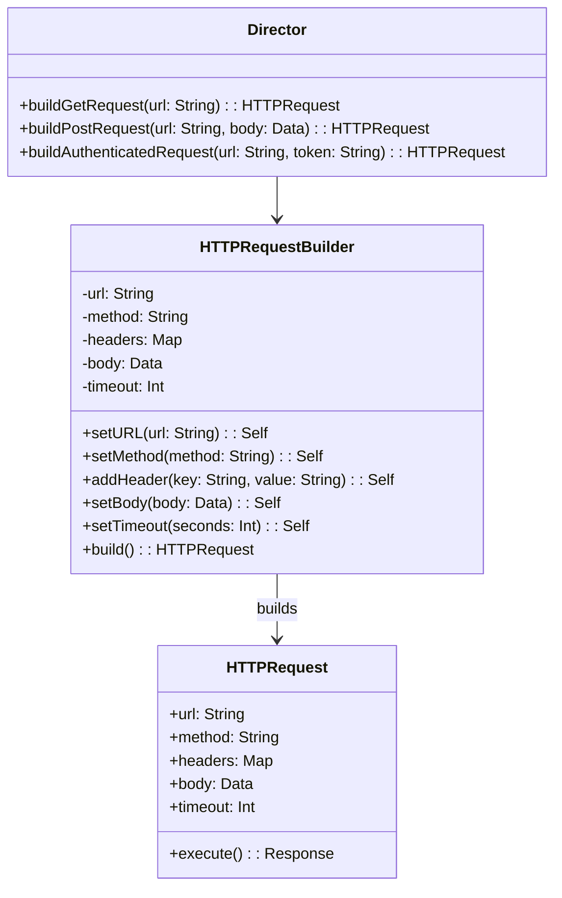

# Builder Pattern

## Intent

Separate the construction of a complex object from its representation so that the same construction process can create different representations. Especially useful in mobile development for building complex UI configurations, network requests, or alert dialogs.

## Problem

Some objects require many parameters during initialization — some optional, some required, some with default values. Telescoping constructors with dozens of parameters are unreadable. Passing `nil` or default values for unused parameters is error-prone.

Consider building an HTTP request: you might need a URL, method, headers, body, timeout, retry policy, caching strategy, and authentication. A single initializer with all these parameters is unwieldy.

## Solution

The Builder pattern constructs the object step by step. Each step configures one aspect of the product. A fluent API with method chaining makes the construction readable. The builder can also validate the configuration before producing the final product.

## UML Diagram



## Swift Implementation

```swift
import Foundation

// MARK: - Product

struct HTTPRequest {
    let url: URL
    let method: String
    let headers: [String: String]
    let body: Data?
    let timeout: TimeInterval
    let retryCount: Int
    let cachePolicy: URLRequest.CachePolicy

    func asURLRequest() -> URLRequest {
        var request = URLRequest(url: url)
        request.httpMethod = method
        request.httpBody = body
        request.timeoutInterval = timeout
        request.cachePolicy = cachePolicy
        headers.forEach { request.setValue($1, forHTTPHeaderField: $0) }
        return request
    }
}

// MARK: - Builder

final class HTTPRequestBuilder {
    private var url: URL?
    private var method: String = "GET"
    private var headers: [String: String] = [:]
    private var body: Data?
    private var timeout: TimeInterval = 30
    private var retryCount: Int = 0
    private var cachePolicy: URLRequest.CachePolicy = .useProtocolCachePolicy

    @discardableResult
    func setURL(_ urlString: String) -> HTTPRequestBuilder {
        self.url = URL(string: urlString)
        return self
    }

    @discardableResult
    func setMethod(_ method: String) -> HTTPRequestBuilder {
        self.method = method
        return self
    }

    @discardableResult
    func addHeader(_ key: String, value: String) -> HTTPRequestBuilder {
        self.headers[key] = value
        return self
    }

    @discardableResult
    func setContentType(_ contentType: String) -> HTTPRequestBuilder {
        return addHeader("Content-Type", value: contentType)
    }

    @discardableResult
    func setBearerToken(_ token: String) -> HTTPRequestBuilder {
        return addHeader("Authorization", value: "Bearer \(token)")
    }

    @discardableResult
    func setJSONBody<T: Encodable>(_ value: T) throws -> HTTPRequestBuilder {
        let encoder = JSONEncoder()
        encoder.keyEncodingStrategy = .convertToSnakeCase
        self.body = try encoder.encode(value)
        return setContentType("application/json")
    }

    @discardableResult
    func setRawBody(_ data: Data) -> HTTPRequestBuilder {
        self.body = data
        return self
    }

    @discardableResult
    func setTimeout(_ seconds: TimeInterval) -> HTTPRequestBuilder {
        self.timeout = seconds
        return self
    }

    @discardableResult
    func setRetryCount(_ count: Int) -> HTTPRequestBuilder {
        self.retryCount = max(0, count)
        return self
    }

    @discardableResult
    func setCachePolicy(_ policy: URLRequest.CachePolicy) -> HTTPRequestBuilder {
        self.cachePolicy = policy
        return self
    }

    func build() throws -> HTTPRequest {
        guard let url = url else {
            throw BuilderError.missingURL
        }
        return HTTPRequest(
            url: url,
            method: method,
            headers: headers,
            body: body,
            timeout: timeout,
            retryCount: retryCount,
            cachePolicy: cachePolicy
        )
    }
}

enum BuilderError: Error, LocalizedError {
    case missingURL
    case invalidConfiguration(String)

    var errorDescription: String? {
        switch self {
        case .missingURL:
            return "URL is required"
        case .invalidConfiguration(let reason):
            return "Invalid configuration: \(reason)"
        }
    }
}

// MARK: - Director

struct RequestDirector {
    static func makeGetRequest(url: String) throws -> HTTPRequest {
        return try HTTPRequestBuilder()
            .setURL(url)
            .setMethod("GET")
            .addHeader("Accept", value: "application/json")
            .build()
    }

    static func makeAuthenticatedPost<T: Encodable>(
        url: String,
        token: String,
        body: T
    ) throws -> HTTPRequest {
        return try HTTPRequestBuilder()
            .setURL(url)
            .setMethod("POST")
            .setBearerToken(token)
            .setJSONBody(body)
            .setTimeout(60)
            .setRetryCount(3)
            .build()
    }

    static func makeFileUpload(url: String, data: Data) throws -> HTTPRequest {
        return try HTTPRequestBuilder()
            .setURL(url)
            .setMethod("POST")
            .setContentType("application/octet-stream")
            .setRawBody(data)
            .setTimeout(120)
            .setCachePolicy(.reloadIgnoringLocalCacheData)
            .build()
    }
}

// MARK: - Usage

struct LoginRequest: Encodable {
    let email: String
    let password: String
}

func performLogin() throws {
    let request = try RequestDirector.makeAuthenticatedPost(
        url: "https://api.example.com/login",
        token: "temp-token",
        body: LoginRequest(email: "user@test.com", password: "secret")
    )
    print("Request: \(request.method) \(request.url)")
    print("Headers: \(request.headers)")
    print("Timeout: \(request.timeout)s")
}
```

## Dart Implementation

```dart
import 'dart:convert';
import 'dart:typed_data';

// Product
class HTTPRequest {
  final Uri url;
  final String method;
  final Map<String, String> headers;
  final Uint8List? body;
  final Duration timeout;
  final int retryCount;

  const HTTPRequest({
    required this.url,
    required this.method,
    required this.headers,
    this.body,
    required this.timeout,
    required this.retryCount,
  });

  @override
  String toString() => '$method $url (timeout: ${timeout.inSeconds}s, retries: $retryCount)';
}

// Builder
class HTTPRequestBuilder {
  Uri? _url;
  String _method = 'GET';
  final Map<String, String> _headers = {};
  Uint8List? _body;
  Duration _timeout = const Duration(seconds: 30);
  int _retryCount = 0;

  HTTPRequestBuilder setURL(String urlString) {
    _url = Uri.parse(urlString);
    return this;
  }

  HTTPRequestBuilder setMethod(String method) {
    _method = method;
    return this;
  }

  HTTPRequestBuilder addHeader(String key, String value) {
    _headers[key] = value;
    return this;
  }

  HTTPRequestBuilder setContentType(String contentType) {
    return addHeader('Content-Type', contentType);
  }

  HTTPRequestBuilder setBearerToken(String token) {
    return addHeader('Authorization', 'Bearer $token');
  }

  HTTPRequestBuilder setJSONBody(Map<String, dynamic> json) {
    _body = Uint8List.fromList(utf8.encode(jsonEncode(json)));
    return setContentType('application/json');
  }

  HTTPRequestBuilder setRawBody(Uint8List data) {
    _body = data;
    return this;
  }

  HTTPRequestBuilder setTimeout(Duration timeout) {
    _timeout = timeout;
    return this;
  }

  HTTPRequestBuilder setRetryCount(int count) {
    _retryCount = count < 0 ? 0 : count;
    return this;
  }

  HTTPRequest build() {
    if (_url == null) {
      throw StateError('URL is required');
    }
    return HTTPRequest(
      url: _url!,
      method: _method,
      headers: Map.unmodifiable(_headers),
      body: _body,
      timeout: _timeout,
      retryCount: _retryCount,
    );
  }
}

// Director
class RequestDirector {
  static HTTPRequest makeGetRequest(String url) {
    return HTTPRequestBuilder()
        .setURL(url)
        .setMethod('GET')
        .addHeader('Accept', 'application/json')
        .build();
  }

  static HTTPRequest makeAuthenticatedPost({
    required String url,
    required String token,
    required Map<String, dynamic> body,
  }) {
    return HTTPRequestBuilder()
        .setURL(url)
        .setMethod('POST')
        .setBearerToken(token)
        .setJSONBody(body)
        .setTimeout(const Duration(seconds: 60))
        .setRetryCount(3)
        .build();
  }

  static HTTPRequest makeFileUpload({
    required String url,
    required Uint8List data,
  }) {
    return HTTPRequestBuilder()
        .setURL(url)
        .setMethod('POST')
        .setContentType('application/octet-stream')
        .setRawBody(data)
        .setTimeout(const Duration(seconds: 120))
        .build();
  }
}

// Usage
void main() {
  final request = RequestDirector.makeAuthenticatedPost(
    url: 'https://api.example.com/login',
    token: 'temp-token',
    body: {'email': 'user@test.com', 'password': 'secret'},
  );

  print('Request: ${request.method} ${request.url}');
  print('Headers: ${request.headers}');
  print('Timeout: ${request.timeout.inSeconds}s');
  print('Retries: ${request.retryCount}');
}
```

## TypeScript Implementation

```typescript
// Product
interface HTTPRequest {
  readonly url: string;
  readonly method: string;
  readonly headers: Record<string, string>;
  readonly body?: string;
  readonly timeout: number;
  readonly retryCount: number;
}

// Builder
class HTTPRequestBuilder {
  private _url?: string;
  private _method: string = "GET";
  private _headers: Record<string, string> = {};
  private _body?: string;
  private _timeout: number = 30000;
  private _retryCount: number = 0;

  setURL(url: string): this {
    this._url = url;
    return this;
  }

  setMethod(method: string): this {
    this._method = method;
    return this;
  }

  addHeader(key: string, value: string): this {
    this._headers[key] = value;
    return this;
  }

  setContentType(contentType: string): this {
    return this.addHeader("Content-Type", contentType);
  }

  setBearerToken(token: string): this {
    return this.addHeader("Authorization", `Bearer ${token}`);
  }

  setJSONBody(body: Record<string, unknown>): this {
    this._body = JSON.stringify(body);
    return this.setContentType("application/json");
  }

  setRawBody(body: string): this {
    this._body = body;
    return this;
  }

  setTimeout(ms: number): this {
    this._timeout = ms;
    return this;
  }

  setRetryCount(count: number): this {
    this._retryCount = Math.max(0, count);
    return this;
  }

  build(): HTTPRequest {
    if (!this._url) {
      throw new Error("URL is required");
    }

    return Object.freeze({
      url: this._url,
      method: this._method,
      headers: { ...this._headers },
      body: this._body,
      timeout: this._timeout,
      retryCount: this._retryCount,
    });
  }
}

// Director
class RequestDirector {
  static makeGetRequest(url: string): HTTPRequest {
    return new HTTPRequestBuilder()
      .setURL(url)
      .setMethod("GET")
      .addHeader("Accept", "application/json")
      .build();
  }

  static makeAuthenticatedPost(
    url: string,
    token: string,
    body: Record<string, unknown>
  ): HTTPRequest {
    return new HTTPRequestBuilder()
      .setURL(url)
      .setMethod("POST")
      .setBearerToken(token)
      .setJSONBody(body)
      .setTimeout(60000)
      .setRetryCount(3)
      .build();
  }

  static makeFileUpload(url: string, data: string): HTTPRequest {
    return new HTTPRequestBuilder()
      .setURL(url)
      .setMethod("POST")
      .setContentType("application/octet-stream")
      .setRawBody(data)
      .setTimeout(120000)
      .build();
  }
}

// Usage
const request = RequestDirector.makeAuthenticatedPost(
  "https://api.example.com/login",
  "temp-token",
  { email: "user@test.com", password: "secret" }
);

console.log(`Request: ${request.method} ${request.url}`);
console.log(`Headers:`, request.headers);
console.log(`Timeout: ${request.timeout}ms`);
```

## When to Use

| Scenario | Builder? | Reason |
|----------|---------|--------|
| Complex HTTP request configuration | ✅ | Many optional parameters |
| Alert/dialog construction | ✅ | Variable buttons, styles, actions |
| Database query building | ✅ | Dynamic WHERE, ORDER, LIMIT |
| Simple objects with few params | ❌ | Direct init is cleaner |
| Immutable value types | ❌ | Struct init with defaults works fine |

## Real-World Examples

- **Alamofire's `Session.request()`**: Chain-style request configuration
- **Flutter's `Widget` constructors**: Named parameters act like built-in builders
- **URLComponents** in iOS: Step-by-step URL construction
- **Moya's `TargetType`**: Protocol-based request building
- **Retrofit/Dio**: Request builders for HTTP clients
