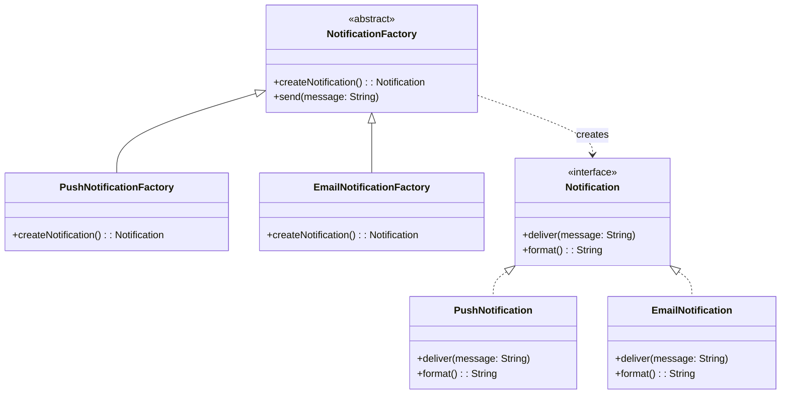

# Factory Method Pattern

## Intent

Define an interface for creating an object, but let subclasses decide which class to instantiate. Factory Method lets a class defer instantiation to subclasses, making it ideal for creating platform-specific UI components or service implementations in mobile apps.

## Problem

Mobile apps often need to create different objects based on runtime conditions — different UI components per platform, different payment processors per region, or different data sources based on configuration. Hardcoding these creation decisions scatters `if/else` or `switch` statements throughout the codebase and violates the Open/Closed Principle.

Consider a notification system that needs to create different notification types (push, email, SMS). Without a factory, every caller needs to know about every notification type and how to configure them.

## Solution

The Factory Method pattern introduces a creator interface with a method for creating objects. Concrete creators override this method to produce specific product types. The client code works with the creator interface and never needs to know which concrete product it receives.

## UML Diagram



## Swift Implementation

```swift
import Foundation

// MARK: - Product Protocol

protocol Notification {
    var title: String { get }
    var body: String { get }
    func deliver() async throws
    func format() -> String
}

// MARK: - Concrete Products

struct PushNotification: Notification {
    let title: String
    let body: String
    let deviceToken: String
    let badge: Int
    let sound: String

    func deliver() async throws {
        let payload: [String: Any] = [
            "aps": [
                "alert": ["title": title, "body": body],
                "badge": badge,
                "sound": sound
            ]
        ]
        print("Sending push to \(deviceToken): \(payload)")
    }

    func format() -> String {
        return "📱 [\(title)] \(body)"
    }
}

struct EmailNotification: Notification {
    let title: String
    let body: String
    let recipient: String
    let isHTML: Bool

    func deliver() async throws {
        let contentType = isHTML ? "text/html" : "text/plain"
        print("Sending email to \(recipient) (\(contentType)): \(title)")
    }

    func format() -> String {
        return "📧 To: \(recipient) | Subject: \(title)"
    }
}

struct SMSNotification: Notification {
    let title: String
    let body: String
    let phoneNumber: String

    func deliver() async throws {
        let truncated = body.prefix(160)
        print("Sending SMS to \(phoneNumber): \(truncated)")
    }

    func format() -> String {
        return "💬 To: \(phoneNumber) | \(body.prefix(50))"
    }
}

// MARK: - Creator Protocol

protocol NotificationFactory {
    func createNotification(title: String, body: String) -> Notification
}

extension NotificationFactory {
    func send(title: String, body: String) async throws {
        let notification = createNotification(title: title, body: body)
        print("Formatted: \(notification.format())")
        try await notification.deliver()
    }
}

// MARK: - Concrete Creators

final class PushNotificationFactory: NotificationFactory {
    private let deviceToken: String
    private let defaultSound: String

    init(deviceToken: String, defaultSound: String = "default") {
        self.deviceToken = deviceToken
        self.defaultSound = defaultSound
    }

    func createNotification(title: String, body: String) -> Notification {
        return PushNotification(
            title: title,
            body: body,
            deviceToken: deviceToken,
            badge: 1,
            sound: defaultSound
        )
    }
}

final class EmailNotificationFactory: NotificationFactory {
    private let recipient: String
    private let useHTML: Bool

    init(recipient: String, useHTML: Bool = true) {
        self.recipient = recipient
        self.useHTML = useHTML
    }

    func createNotification(title: String, body: String) -> Notification {
        return EmailNotification(
            title: title,
            body: body,
            recipient: recipient,
            isHTML: useHTML
        )
    }
}

final class SMSNotificationFactory: NotificationFactory {
    private let phoneNumber: String

    init(phoneNumber: String) {
        self.phoneNumber = phoneNumber
    }

    func createNotification(title: String, body: String) -> Notification {
        return SMSNotification(
            title: title,
            body: body,
            phoneNumber: phoneNumber
        )
    }
}

// MARK: - Client Code

func notifyUser(
    via factory: NotificationFactory,
    title: String,
    message: String
) async {
    do {
        try await factory.send(title: title, body: message)
    } catch {
        print("Notification failed: \(error)")
    }
}

// Usage
let pushFactory = PushNotificationFactory(deviceToken: "abc123")
let emailFactory = EmailNotificationFactory(recipient: "user@example.com")

Task {
    await notifyUser(via: pushFactory, title: "New Message", message: "Hello!")
    await notifyUser(via: emailFactory, title: "New Message", message: "Hello!")
}
```

## Dart Implementation

```dart
// Product interface
abstract class Notification {
  String get title;
  String get body;
  Future<void> deliver();
  String format();
}

// Concrete products
class PushNotification implements Notification {
  @override
  final String title;
  @override
  final String body;
  final String deviceToken;
  final int badge;
  final String sound;

  PushNotification({
    required this.title,
    required this.body,
    required this.deviceToken,
    this.badge = 1,
    this.sound = 'default',
  });

  @override
  Future<void> deliver() async {
    final payload = {
      'aps': {
        'alert': {'title': title, 'body': body},
        'badge': badge,
        'sound': sound,
      }
    };
    print('Sending push to $deviceToken: $payload');
  }

  @override
  String format() => '📱 [$title] $body';
}

class EmailNotification implements Notification {
  @override
  final String title;
  @override
  final String body;
  final String recipient;
  final bool isHTML;

  EmailNotification({
    required this.title,
    required this.body,
    required this.recipient,
    this.isHTML = true,
  });

  @override
  Future<void> deliver() async {
    final contentType = isHTML ? 'text/html' : 'text/plain';
    print('Sending email to $recipient ($contentType): $title');
  }

  @override
  String format() => '📧 To: $recipient | Subject: $title';
}

class SMSNotification implements Notification {
  @override
  final String title;
  @override
  final String body;
  final String phoneNumber;

  SMSNotification({
    required this.title,
    required this.body,
    required this.phoneNumber,
  });

  @override
  Future<void> deliver() async {
    final truncated = body.length > 160 ? body.substring(0, 160) : body;
    print('Sending SMS to $phoneNumber: $truncated');
  }

  @override
  String format() => '💬 To: $phoneNumber | ${body.substring(0, body.length.clamp(0, 50))}';
}

// Creator interface
abstract class NotificationFactory {
  Notification createNotification({
    required String title,
    required String body,
  });

  Future<void> send({required String title, required String body}) async {
    final notification = createNotification(title: title, body: body);
    print('Formatted: ${notification.format()}');
    await notification.deliver();
  }
}

// Concrete creators
class PushNotificationFactory extends NotificationFactory {
  final String deviceToken;
  final String defaultSound;

  PushNotificationFactory({
    required this.deviceToken,
    this.defaultSound = 'default',
  });

  @override
  Notification createNotification({required String title, required String body}) {
    return PushNotification(
      title: title,
      body: body,
      deviceToken: deviceToken,
      sound: defaultSound,
    );
  }
}

class EmailNotificationFactory extends NotificationFactory {
  final String recipient;
  final bool useHTML;

  EmailNotificationFactory({
    required this.recipient,
    this.useHTML = true,
  });

  @override
  Notification createNotification({required String title, required String body}) {
    return EmailNotification(
      title: title,
      body: body,
      recipient: recipient,
      isHTML: useHTML,
    );
  }
}

class SMSNotificationFactory extends NotificationFactory {
  final String phoneNumber;

  SMSNotificationFactory({required this.phoneNumber});

  @override
  Notification createNotification({required String title, required String body}) {
    return SMSNotification(
      title: title,
      body: body,
      phoneNumber: phoneNumber,
    );
  }
}

// Usage
void main() async {
  final factories = <NotificationFactory>[
    PushNotificationFactory(deviceToken: 'abc123'),
    EmailNotificationFactory(recipient: 'user@example.com'),
    SMSNotificationFactory(phoneNumber: '+1234567890'),
  ];

  for (final factory in factories) {
    await factory.send(title: 'New Message', body: 'Hello there!');
    print('---');
  }
}
```

## TypeScript Implementation

```typescript
// Product interface
interface Notification {
  readonly title: string;
  readonly body: string;
  deliver(): Promise<void>;
  format(): string;
}

// Concrete products
class PushNotification implements Notification {
  constructor(
    public readonly title: string,
    public readonly body: string,
    private readonly deviceToken: string,
    private readonly badge: number = 1,
    private readonly sound: string = "default"
  ) {}

  async deliver(): Promise<void> {
    const payload = {
      aps: {
        alert: { title: this.title, body: this.body },
        badge: this.badge,
        sound: this.sound,
      },
    };
    console.log(`Sending push to ${this.deviceToken}:`, payload);
  }

  format(): string {
    return `📱 [${this.title}] ${this.body}`;
  }
}

class EmailNotification implements Notification {
  constructor(
    public readonly title: string,
    public readonly body: string,
    private readonly recipient: string,
    private readonly isHTML: boolean = true
  ) {}

  async deliver(): Promise<void> {
    const contentType = this.isHTML ? "text/html" : "text/plain";
    console.log(`Sending email to ${this.recipient} (${contentType}): ${this.title}`);
  }

  format(): string {
    return `📧 To: ${this.recipient} | Subject: ${this.title}`;
  }
}

class SMSNotification implements Notification {
  constructor(
    public readonly title: string,
    public readonly body: string,
    private readonly phoneNumber: string
  ) {}

  async deliver(): Promise<void> {
    const truncated = this.body.substring(0, 160);
    console.log(`Sending SMS to ${this.phoneNumber}: ${truncated}`);
  }

  format(): string {
    return `💬 To: ${this.phoneNumber} | ${this.body.substring(0, 50)}`;
  }
}

// Creator interface
abstract class NotificationFactory {
  abstract createNotification(title: string, body: string): Notification;

  async send(title: string, body: string): Promise<void> {
    const notification = this.createNotification(title, body);
    console.log(`Formatted: ${notification.format()}`);
    await notification.deliver();
  }
}

// Concrete creators
class PushNotificationFactory extends NotificationFactory {
  constructor(
    private readonly deviceToken: string,
    private readonly defaultSound: string = "default"
  ) {
    super();
  }

  createNotification(title: string, body: string): Notification {
    return new PushNotification(title, body, this.deviceToken, 1, this.defaultSound);
  }
}

class EmailNotificationFactory extends NotificationFactory {
  constructor(
    private readonly recipient: string,
    private readonly useHTML: boolean = true
  ) {
    super();
  }

  createNotification(title: string, body: string): Notification {
    return new EmailNotification(title, body, this.recipient, this.useHTML);
  }
}

class SMSNotificationFactory extends NotificationFactory {
  constructor(private readonly phoneNumber: string) {
    super();
  }

  createNotification(title: string, body: string): Notification {
    return new SMSNotification(title, body, this.phoneNumber);
  }
}

// Usage
async function main(): Promise<void> {
  const factories: NotificationFactory[] = [
    new PushNotificationFactory("abc123"),
    new EmailNotificationFactory("user@example.com"),
    new SMSNotificationFactory("+1234567890"),
  ];

  for (const factory of factories) {
    await factory.send("New Message", "Hello there!");
    console.log("---");
  }
}

main();
```

## When to Use

| Scenario | Factory Method? | Reason |
|----------|----------------|--------|
| Platform-specific UI components | ✅ | iOS vs Android widgets |
| Payment processor selection | ✅ | Different providers per region |
| Notification channel routing | ✅ | Push, email, SMS, in-app |
| Data source switching | ✅ | Local DB vs remote API |
| Simple object creation | ❌ | Direct construction is simpler |
| Objects with no variants | ❌ | No subclass needed |

## Real-World Examples

- **UIKit's `UICollectionViewLayout`**: Different layout objects created by factory methods
- **Flutter's `ThemeData`**: Factory constructors for light/dark themes
- **Dio interceptors** in Dart: Factories for creating request/response interceptors
- **React Native's `Platform.select()`**: Platform-specific component creation
- **Firebase Messaging**: Different message handlers per platform
