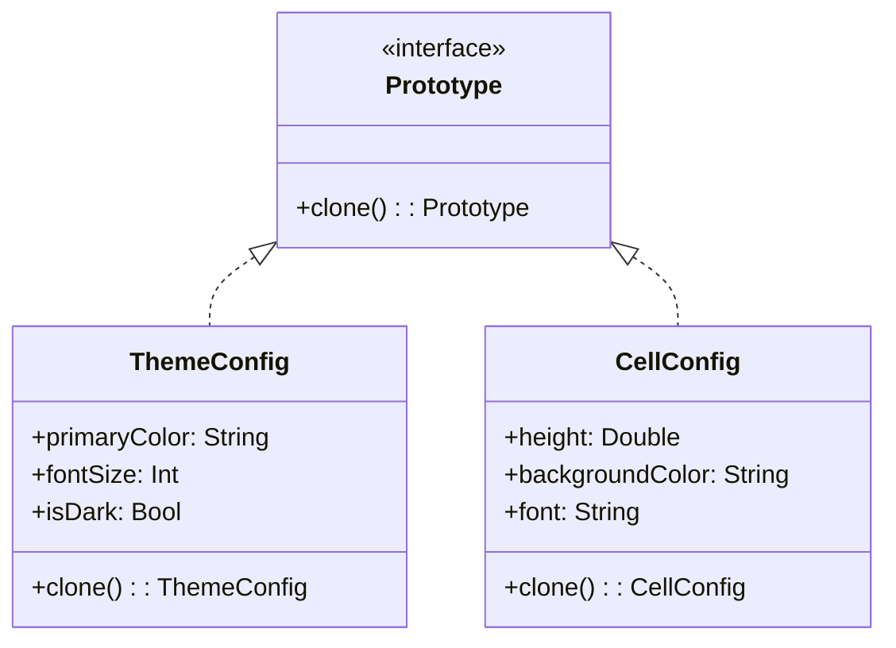

# Prototype Pattern

## Intent

Specify the kinds of objects to create using a prototypical instance, and create new objects by copying this prototype. In mobile apps, this is useful for cloning configuration objects, cell templates, or theme instances without coupling to their concrete classes.

## Problem

Sometimes creating an object from scratch is expensive — it might involve network calls, database reads, or complex computations. Other times, you need a copy of an existing object with slight modifications. Without the Prototype pattern, you'd need to know the exact class of the object and all its fields to create a copy manually, which breaks encapsulation.

## Solution

The Prototype pattern delegates the cloning process to the objects themselves. Each clonable object implements a `clone()` method that creates an exact copy. The client can then modify the clone without affecting the original.

## UML Diagram



## Swift Implementation

```swift
import Foundation

// MARK: - Prototype Protocol

protocol Prototype: AnyObject {
    func clone() -> Self
}

// MARK: - Theme Configuration

final class ThemeConfig: Prototype {
    var primaryColor: String
    var secondaryColor: String
    var backgroundColor: String
    var textColor: String
    var fontSize: Double
    var fontFamily: String
    var cornerRadius: Double
    var isDarkMode: Bool
    var spacing: Double
    var animationDuration: Double

    init(
        primaryColor: String = "#007AFF",
        secondaryColor: String = "#5856D6",
        backgroundColor: String = "#FFFFFF",
        textColor: String = "#000000",
        fontSize: Double = 16.0,
        fontFamily: String = "SF Pro",
        cornerRadius: Double = 8.0,
        isDarkMode: Bool = false,
        spacing: Double = 8.0,
        animationDuration: Double = 0.3
    ) {
        self.primaryColor = primaryColor
        self.secondaryColor = secondaryColor
        self.backgroundColor = backgroundColor
        self.textColor = textColor
        self.fontSize = fontSize
        self.fontFamily = fontFamily
        self.cornerRadius = cornerRadius
        self.isDarkMode = isDarkMode
        self.spacing = spacing
        self.animationDuration = animationDuration
    }

    func clone() -> ThemeConfig {
        return ThemeConfig(
            primaryColor: primaryColor,
            secondaryColor: secondaryColor,
            backgroundColor: backgroundColor,
            textColor: textColor,
            fontSize: fontSize,
            fontFamily: fontFamily,
            cornerRadius: cornerRadius,
            isDarkMode: isDarkMode,
            spacing: spacing,
            animationDuration: animationDuration
        )
    }

    func description() -> String {
        return "Theme(primary: \(primaryColor), dark: \(isDarkMode), font: \(fontSize)pt \(fontFamily))"
    }
}

// MARK: - Prototype Registry

final class ThemeRegistry {
    private var themes: [String: ThemeConfig] = [:]

    func register(_ name: String, theme: ThemeConfig) {
        themes[name] = theme
    }

    func create(_ name: String) -> ThemeConfig? {
        return themes[name]?.clone()
    }

    var availableThemes: [String] {
        return Array(themes.keys.sorted())
    }
}

// MARK: - Predefined Themes

extension ThemeConfig {
    static let light: ThemeConfig = {
        let theme = ThemeConfig()
        theme.isDarkMode = false
        theme.backgroundColor = "#FFFFFF"
        theme.textColor = "#1C1C1E"
        return theme
    }()

    static let dark: ThemeConfig = {
        let theme = ThemeConfig()
        theme.isDarkMode = true
        theme.backgroundColor = "#1C1C1E"
        theme.textColor = "#FFFFFF"
        theme.primaryColor = "#0A84FF"
        theme.secondaryColor = "#5E5CE6"
        return theme
    }()

    static let highContrast: ThemeConfig = {
        let theme = ThemeConfig.dark.clone()
        theme.primaryColor = "#FFD60A"
        theme.textColor = "#FFFFFF"
        theme.fontSize = 20.0
        return theme
    }()
}

// MARK: - Usage

let registry = ThemeRegistry()
registry.register("light", theme: ThemeConfig.light)
registry.register("dark", theme: ThemeConfig.dark)
registry.register("highContrast", theme: ThemeConfig.highContrast)

// Clone and customize
if let userTheme = registry.create("dark") {
    userTheme.primaryColor = "#FF453A"
    userTheme.fontSize = 18.0
    print("Custom theme: \(userTheme.description())")
    print("Original dark: \(ThemeConfig.dark.description())")
}
```

## Dart Implementation

```dart
// Prototype mixin
mixin Cloneable<T> {
  T clone();
}

// Theme configuration
class ThemeConfig with Cloneable<ThemeConfig> {
  String primaryColor;
  String secondaryColor;
  String backgroundColor;
  String textColor;
  double fontSize;
  String fontFamily;
  double cornerRadius;
  bool isDarkMode;
  double spacing;
  double animationDuration;

  ThemeConfig({
    this.primaryColor = '#007AFF',
    this.secondaryColor = '#5856D6',
    this.backgroundColor = '#FFFFFF',
    this.textColor = '#000000',
    this.fontSize = 16.0,
    this.fontFamily = 'Roboto',
    this.cornerRadius = 8.0,
    this.isDarkMode = false,
    this.spacing = 8.0,
    this.animationDuration = 0.3,
  });

  @override
  ThemeConfig clone() {
    return ThemeConfig(
      primaryColor: primaryColor,
      secondaryColor: secondaryColor,
      backgroundColor: backgroundColor,
      textColor: textColor,
      fontSize: fontSize,
      fontFamily: fontFamily,
      cornerRadius: cornerRadius,
      isDarkMode: isDarkMode,
      spacing: spacing,
      animationDuration: animationDuration,
    );
  }

  @override
  String toString() =>
      'Theme(primary: $primaryColor, dark: $isDarkMode, font: ${fontSize}pt $fontFamily)';

  static final ThemeConfig light = ThemeConfig();

  static final ThemeConfig dark = ThemeConfig(
    isDarkMode: true,
    backgroundColor: '#1C1C1E',
    textColor: '#FFFFFF',
    primaryColor: '#0A84FF',
    secondaryColor: '#5E5CE6',
  );

  static ThemeConfig get highContrast {
    final theme = dark.clone();
    theme.primaryColor = '#FFD60A';
    theme.fontSize = 20.0;
    return theme;
  }
}

// Prototype registry
class ThemeRegistry {
  final Map<String, ThemeConfig> _themes = {};

  void register(String name, ThemeConfig theme) {
    _themes[name] = theme;
  }

  ThemeConfig? create(String name) {
    return _themes[name]?.clone();
  }

  List<String> get availableThemes => _themes.keys.toList()..sort();
}

// Usage
void main() {
  final registry = ThemeRegistry();
  registry.register('light', ThemeConfig.light);
  registry.register('dark', ThemeConfig.dark);
  registry.register('highContrast', ThemeConfig.highContrast);

  print('Available: ${registry.availableThemes}');

  final userTheme = registry.create('dark');
  if (userTheme != null) {
    userTheme.primaryColor = '#FF453A';
    userTheme.fontSize = 18.0;
    print('Custom: $userTheme');
    print('Original dark: ${ThemeConfig.dark}');
  }
}
```

## TypeScript Implementation

```typescript
// Prototype interface
interface Prototype<T> {
  clone(): T;
}

// Theme configuration
class ThemeConfig implements Prototype<ThemeConfig> {
  primaryColor: string;
  secondaryColor: string;
  backgroundColor: string;
  textColor: string;
  fontSize: number;
  fontFamily: string;
  cornerRadius: number;
  isDarkMode: boolean;
  spacing: number;
  animationDuration: number;

  constructor(params: Partial<ThemeConfig> = {}) {
    this.primaryColor = params.primaryColor ?? "#007AFF";
    this.secondaryColor = params.secondaryColor ?? "#5856D6";
    this.backgroundColor = params.backgroundColor ?? "#FFFFFF";
    this.textColor = params.textColor ?? "#000000";
    this.fontSize = params.fontSize ?? 16.0;
    this.fontFamily = params.fontFamily ?? "System";
    this.cornerRadius = params.cornerRadius ?? 8.0;
    this.isDarkMode = params.isDarkMode ?? false;
    this.spacing = params.spacing ?? 8.0;
    this.animationDuration = params.animationDuration ?? 0.3;
  }

  clone(): ThemeConfig {
    return new ThemeConfig({
      primaryColor: this.primaryColor,
      secondaryColor: this.secondaryColor,
      backgroundColor: this.backgroundColor,
      textColor: this.textColor,
      fontSize: this.fontSize,
      fontFamily: this.fontFamily,
      cornerRadius: this.cornerRadius,
      isDarkMode: this.isDarkMode,
      spacing: this.spacing,
      animationDuration: this.animationDuration,
    });
  }

  toString(): string {
    return `Theme(primary: ${this.primaryColor}, dark: ${this.isDarkMode}, font: ${this.fontSize}pt ${this.fontFamily})`;
  }

  static readonly light = new ThemeConfig();

  static readonly dark = new ThemeConfig({
    isDarkMode: true,
    backgroundColor: "#1C1C1E",
    textColor: "#FFFFFF",
    primaryColor: "#0A84FF",
    secondaryColor: "#5E5CE6",
  });

  static get highContrast(): ThemeConfig {
    const theme = ThemeConfig.dark.clone();
    theme.primaryColor = "#FFD60A";
    theme.fontSize = 20.0;
    return theme;
  }
}

// Prototype registry
class ThemeRegistry {
  private themes = new Map<string, ThemeConfig>();

  register(name: string, theme: ThemeConfig): void {
    this.themes.set(name, theme);
  }

  create(name: string): ThemeConfig | undefined {
    return this.themes.get(name)?.clone();
  }

  get availableThemes(): string[] {
    return Array.from(this.themes.keys()).sort();
  }
}

// Usage
const registry = new ThemeRegistry();
registry.register("light", ThemeConfig.light);
registry.register("dark", ThemeConfig.dark);
registry.register("highContrast", ThemeConfig.highContrast);

console.log("Available:", registry.availableThemes);

const userTheme = registry.create("dark");
if (userTheme) {
  userTheme.primaryColor = "#FF453A";
  userTheme.fontSize = 18.0;
  console.log(`Custom: ${userTheme}`);
  console.log(`Original: ${ThemeConfig.dark}`);
}
```

## When to Use

| Scenario | Prototype? | Reason |
|----------|-----------|--------|
| Theme/config cloning | ✅ | Create variations from a base |
| Expensive object initialization | ✅ | Clone is cheaper than rebuild |
| Undo/redo snapshots | ✅ | Save and restore object state |
| Template-based creation | ✅ | Registry of pre-built templates |
| Simple value objects | ❌ | Copy semantics already built in |
| Unique identity objects | ❌ | Cloning would duplicate IDs |

## Real-World Examples

- **UIView snapshotting** in iOS: `snapshotView(afterScreenUpdates:)` clones a view
- **NSCopying** protocol in Foundation: Apple's official cloning protocol
- **Flutter's `copyWith()`**: Immutable widget/state cloning convention
- **Dart's `List.from()`**: Prototype-style collection cloning
- **React's spread operator**: `{...state, count: state.count + 1}` for state cloning
