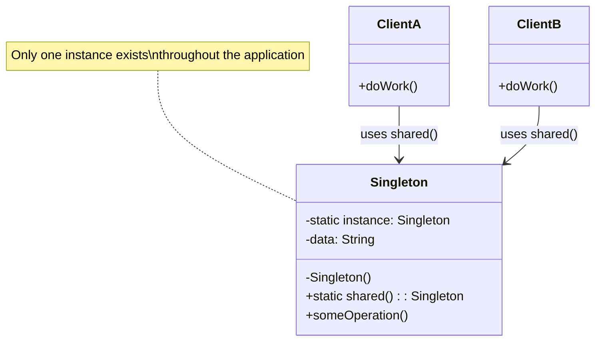

# Singleton Pattern

## Intent

Ensure a class has only one instance and provide a global point of access to it. This is one of the most commonly used patterns in mobile development for managing shared resources like network clients, databases, and configuration managers.

## Problem

In mobile applications, certain objects should exist only once throughout the app lifecycle. For example, you don't want multiple database connections competing for the same file, or multiple analytics managers sending duplicate events. Without the Singleton pattern, developers might accidentally create multiple instances of these shared resources, leading to:

- Data inconsistency
- Resource waste (memory, file handles, network connections)
- Race conditions when multiple instances modify shared state
- Unpredictable behavior across different parts of the app

## Solution

The Singleton pattern solves this by making the class itself responsible for ensuring only one instance exists. It does this by:

1. Making the constructor private so no external code can instantiate it
2. Providing a static method or property that returns the single instance
3. Creating the instance lazily on first access (in most implementations)

## UML Diagram



## Swift Implementation

```swift
import Foundation

// MARK: - Thread-Safe Singleton

final class NetworkManager {
    static let shared = NetworkManager()

    private let session: URLSession
    private let baseURL: URL
    private var authToken: String?

    private init() {
        let config = URLSessionConfiguration.default
        config.timeoutIntervalForRequest = 30
        config.timeoutIntervalForResource = 60
        config.httpMaximumConnectionsPerHost = 5
        self.session = URLSession(configuration: config)
        self.baseURL = URL(string: "https://api.example.com")!
    }

    func setAuthToken(_ token: String) {
        self.authToken = token
    }

    func request<T: Decodable>(
        endpoint: String,
        method: HTTPMethod = .get,
        body: Data? = nil
    ) async throws -> T {
        let url = baseURL.appendingPathComponent(endpoint)
        var request = URLRequest(url: url)
        request.httpMethod = method.rawValue
        request.httpBody = body
        request.setValue("application/json", forHTTPHeaderField: "Content-Type")

        if let token = authToken {
            request.setValue("Bearer \(token)", forHTTPHeaderField: "Authorization")
        }

        let (data, response) = try await session.data(for: request)

        guard let httpResponse = response as? HTTPURLResponse else {
            throw NetworkError.invalidResponse
        }

        guard (200...299).contains(httpResponse.statusCode) else {
            throw NetworkError.httpError(statusCode: httpResponse.statusCode)
        }

        let decoder = JSONDecoder()
        decoder.keyDecodingStrategy = .convertFromSnakeCase
        decoder.dateDecodingStrategy = .iso8601
        return try decoder.decode(T.self, from: data)
    }
}

enum HTTPMethod: String {
    case get = "GET"
    case post = "POST"
    case put = "PUT"
    case delete = "DELETE"
}

enum NetworkError: Error, LocalizedError {
    case invalidResponse
    case httpError(statusCode: Int)
    case decodingFailed

    var errorDescription: String? {
        switch self {
        case .invalidResponse:
            return "Invalid server response"
        case .httpError(let code):
            return "HTTP error with status code \(code)"
        case .decodingFailed:
            return "Failed to decode response"
        }
    }
}

// MARK: - Usage

struct User: Decodable {
    let id: Int
    let name: String
    let email: String
}

func fetchCurrentUser() async {
    do {
        let user: User = try await NetworkManager.shared.request(endpoint: "/me")
        print("Logged in as: \(user.name)")
    } catch {
        print("Error: \(error.localizedDescription)")
    }
}
```

## Dart Implementation

```dart
import 'dart:convert';
import 'package:http/http.dart' as http;

/// Thread-safe Singleton using Dart's factory constructor.
class NetworkManager {
  static final NetworkManager _instance = NetworkManager._internal();
  static NetworkManager get shared => _instance;

  factory NetworkManager() => _instance;

  final String _baseURL = 'https://api.example.com';
  final http.Client _client = http.Client();
  String? _authToken;
  Duration _timeout = const Duration(seconds: 30);

  NetworkManager._internal();

  void setAuthToken(String token) {
    _authToken = token;
  }

  void setTimeout(Duration timeout) {
    _timeout = timeout;
  }

  Future<T> request<T>({
    required String endpoint,
    String method = 'GET',
    Map<String, dynamic>? body,
    required T Function(Map<String, dynamic>) fromJson,
  }) async {
    final uri = Uri.parse('$_baseURL$endpoint');

    final headers = <String, String>{
      'Content-Type': 'application/json',
    };

    if (_authToken != null) {
      headers['Authorization'] = 'Bearer $_authToken';
    }

    http.Response response;

    switch (method.toUpperCase()) {
      case 'POST':
        response = await _client
            .post(uri, headers: headers, body: jsonEncode(body))
            .timeout(_timeout);
        break;
      case 'PUT':
        response = await _client
            .put(uri, headers: headers, body: jsonEncode(body))
            .timeout(_timeout);
        break;
      case 'DELETE':
        response = await _client
            .delete(uri, headers: headers)
            .timeout(_timeout);
        break;
      default:
        response = await _client
            .get(uri, headers: headers)
            .timeout(_timeout);
    }

    if (response.statusCode < 200 || response.statusCode >= 300) {
      throw NetworkException(
        'HTTP ${response.statusCode}',
        response.statusCode,
      );
    }

    final json = jsonDecode(response.body) as Map<String, dynamic>;
    return fromJson(json);
  }

  void dispose() {
    _client.close();
  }
}

class NetworkException implements Exception {
  final String message;
  final int statusCode;

  NetworkException(this.message, this.statusCode);

  @override
  String toString() => 'NetworkException($statusCode): $message';
}

// Usage
class User {
  final int id;
  final String name;
  final String email;

  User({required this.id, required this.name, required this.email});

  factory User.fromJson(Map<String, dynamic> json) {
    return User(
      id: json['id'] as int,
      name: json['name'] as String,
      email: json['email'] as String,
    );
  }
}

Future<void> fetchCurrentUser() async {
  try {
    final user = await NetworkManager.shared.request<User>(
      endpoint: '/me',
      fromJson: User.fromJson,
    );
    print('Logged in as: ${user.name}');
  } catch (e) {
    print('Error: $e');
  }
}
```

## TypeScript Implementation

```typescript
interface RequestOptions {
  method?: "GET" | "POST" | "PUT" | "DELETE";
  body?: Record<string, unknown>;
  headers?: Record<string, string>;
}

class NetworkError extends Error {
  constructor(
    message: string,
    public readonly statusCode: number
  ) {
    super(message);
    this.name = "NetworkError";
  }
}

class NetworkManager {
  private static _instance: NetworkManager | null = null;
  private readonly baseURL: string = "https://api.example.com";
  private authToken: string | null = null;
  private timeout: number = 30000;

  private constructor() {}

  static get shared(): NetworkManager {
    if (!NetworkManager._instance) {
      NetworkManager._instance = new NetworkManager();
    }
    return NetworkManager._instance;
  }

  setAuthToken(token: string): void {
    this.authToken = token;
  }

  setTimeout(ms: number): void {
    this.timeout = ms;
  }

  async request<T>(endpoint: string, options: RequestOptions = {}): Promise<T> {
    const { method = "GET", body, headers = {} } = options;

    const url = `${this.baseURL}${endpoint}`;

    const requestHeaders: Record<string, string> = {
      "Content-Type": "application/json",
      ...headers,
    };

    if (this.authToken) {
      requestHeaders["Authorization"] = `Bearer ${this.authToken}`;
    }

    const controller = new AbortController();
    const timeoutId = setTimeout(() => controller.abort(), this.timeout);

    try {
      const response = await fetch(url, {
        method,
        headers: requestHeaders,
        body: body ? JSON.stringify(body) : undefined,
        signal: controller.signal,
      });

      if (!response.ok) {
        throw new NetworkError(
          `HTTP error ${response.status}`,
          response.status
        );
      }

      return (await response.json()) as T;
    } finally {
      clearTimeout(timeoutId);
    }
  }
}

// Usage
interface User {
  id: number;
  name: string;
  email: string;
}

async function fetchCurrentUser(): Promise<void> {
  try {
    const user = await NetworkManager.shared.request<User>("/me");
    console.log(`Logged in as: ${user.name}`);
  } catch (error) {
    console.error(`Error: ${error}`);
  }
}
```

## When to Use

| Scenario | Singleton? | Reason |
|----------|-----------|--------|
| Network/API client | ✅ | Shared session configuration, connection pooling |
| Database manager | ✅ | Single write connection, transaction safety |
| Analytics service | ✅ | Centralized event tracking |
| App configuration | ✅ | Single source of truth for settings |
| Logger | ✅ | Consistent log destination |
| View models | ❌ | Should be scoped to screen lifecycle |
| Data models | ❌ | Multiple instances are expected |
| Utility classes | ❌ | Use static methods instead |

## Real-World Examples

- **URLSession.shared** in iOS — Apple's default shared URL session
- **UserDefaults.standard** in iOS — Shared user defaults store
- **FirebaseApp** in Firebase SDK — Single Firebase configuration
- **GetIt** in Flutter — Service locator that itself is a singleton
- **SharedPreferences** in Android/Flutter — Singleton access to key-value storage

## Pitfalls

1. **Testing difficulty**: Singletons carry state across tests. Use protocol-based abstraction for testability.
2. **Hidden dependencies**: Classes that use singletons have implicit dependencies not visible in their initializers.
3. **Thread safety**: Ensure your singleton is safe for concurrent access, especially when mutating state.
4. **Lifecycle management**: Singletons live for the entire app lifecycle — be mindful of memory.

## Testing Strategy

Abstract the singleton behind a protocol so you can inject mock implementations in tests:

```swift
protocol NetworkService {
    func request<T: Decodable>(endpoint: String) async throws -> T
}

extension NetworkManager: NetworkService {}

class MockNetworkService: NetworkService {
    var mockData: Data?
    var mockError: Error?

    func request<T: Decodable>(endpoint: String) async throws -> T {
        if let error = mockError { throw error }
        guard let data = mockData else { throw NetworkError.invalidResponse }
        return try JSONDecoder().decode(T.self, from: data)
    }
}
```
