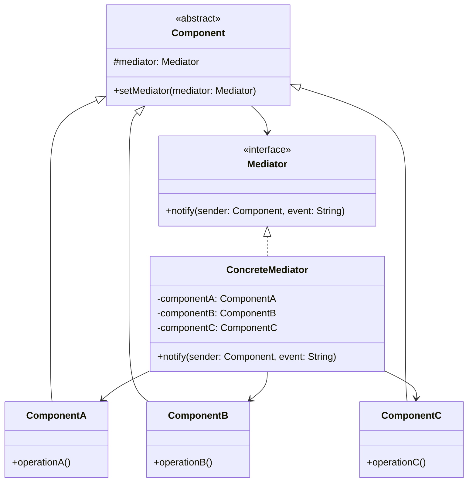

# Mediator Pattern

## Intent

Define an object that encapsulates how a set of objects interact. The Mediator promotes loose coupling by keeping objects from referring to each other explicitly and lets you vary their interaction independently. In mobile development, this pattern is essential for managing complex UI interactions and component communication.

## Problem

Mobile applications often feature screens with multiple interactive components that need to communicate with each other. Consider a flight booking form with:

- Origin city selector
- Destination city selector
- Departure date picker
- Return date picker
- Passenger count selector
- Class selector (economy, business, first)
- Search button

Without proper coordination, these components become tightly coupled:

```swift
// Bad: Components directly reference each other
class OriginSelector {
    var destinationSelector: DestinationSelector?
    var departureDate: DatePicker?
    var searchButton: SearchButton?
    
    func onCitySelected(_ city: City) {
        // Update destination to exclude selected origin
        destinationSelector?.excludeCity(city)
        
        // Update available dates based on origin
        departureDate?.updateAvailableDates(for: city)
        
        // Enable search if all required fields are filled
        if destinationSelector?.selectedCity != nil {
            searchButton?.isEnabled = true
        }
    }
}
```

This approach creates problems:

1. **Tight Coupling**: Each component knows about many others
2. **Hard to Test**: Testing one component requires mocking all its dependencies
3. **Difficult to Modify**: Adding a new component requires updating many existing ones
4. **Code Duplication**: Validation logic scattered across components
5. **Complex Dependencies**: Circular references become hard to manage

## Solution

The Mediator pattern introduces a central coordinator that handles all component interactions. Components only know about the mediator, not each other, dramatically reducing coupling and simplifying the system.

## UML Diagram



## Swift Implementation

### Basic Form Mediator

```swift
import UIKit
import Combine

// MARK: - Mediator Protocol

protocol FormMediator: AnyObject {
    func notify(sender: FormComponent, event: FormEvent)
    func register(_ component: FormComponent)
}

// MARK: - Events

enum FormEvent {
    case valueChanged(Any?)
    case validationStateChanged(Bool)
    case focused
    case unfocused
    case submitted
    case reset
}

// MARK: - Component Protocol

protocol FormComponent: AnyObject {
    var identifier: String { get }
    var mediator: FormMediator? { get set }
    var isValid: Bool { get }
    func reset()
    func validate() -> Bool
}

extension FormComponent {
    func notifyMediator(_ event: FormEvent) {
        mediator?.notify(sender: self, event: event)
    }
}

// MARK: - Concrete Components

final class TextInputComponent: UIView, FormComponent {
    let identifier: String
    weak var mediator: FormMediator?
    
    private let textField = UITextField()
    private let errorLabel = UILabel()
    private let validationRules: [(String) -> Bool]
    
    var text: String {
        get { textField.text ?? "" }
        set { textField.text = newValue }
    }
    
    var isValid: Bool {
        validationRules.allSatisfy { $0(text) }
    }
    
    init(identifier: String, placeholder: String, rules: [(String) -> Bool] = []) {
        self.identifier = identifier
        self.validationRules = rules
        super.init(frame: .zero)
        setupUI(placeholder: placeholder)
    }
    
    required init?(coder: NSCoder) {
        fatalError("init(coder:) has not been implemented")
    }
    
    private func setupUI(placeholder: String) {
        textField.placeholder = placeholder
        textField.borderStyle = .roundedRect
        textField.addTarget(self, action: #selector(textDidChange), for: .editingChanged)
        textField.addTarget(self, action: #selector(didBeginEditing), for: .editingDidBegin)
        textField.addTarget(self, action: #selector(didEndEditing), for: .editingDidEnd)
        
        errorLabel.textColor = .systemRed
        errorLabel.font = .systemFont(ofSize: 12)
        errorLabel.isHidden = true
        
        let stack = UIStackView(arrangedSubviews: [textField, errorLabel])
        stack.axis = .vertical
        stack.spacing = 4
        stack.translatesAutoresizingMaskIntoConstraints = false
        
        addSubview(stack)
        NSLayoutConstraint.activate([
            stack.topAnchor.constraint(equalTo: topAnchor),
            stack.leadingAnchor.constraint(equalTo: leadingAnchor),
            stack.trailingAnchor.constraint(equalTo: trailingAnchor),
            stack.bottomAnchor.constraint(equalTo: bottomAnchor)
        ])
    }
    
    @objc private func textDidChange() {
        notifyMediator(.valueChanged(text))
        let valid = validate()
        notifyMediator(.validationStateChanged(valid))
    }
    
    @objc private func didBeginEditing() {
        notifyMediator(.focused)
    }
    
    @objc private func didEndEditing() {
        notifyMediator(.unfocused)
    }
    
    func showError(_ message: String) {
        errorLabel.text = message
        errorLabel.isHidden = false
        textField.layer.borderColor = UIColor.systemRed.cgColor
        textField.layer.borderWidth = 1
    }
    
    func hideError() {
        errorLabel.isHidden = true
        textField.layer.borderWidth = 0
    }
    
    func reset() {
        text = ""
        hideError()
    }
    
    func validate() -> Bool {
        let valid = isValid
        if !valid && !text.isEmpty {
            showError("Invalid input")
        } else {
            hideError()
        }
        return valid
    }
}

final class DropdownComponent: UIView, FormComponent {
    let identifier: String
    weak var mediator: FormMediator?
    
    private let button = UIButton(type: .system)
    private var options: [String] = []
    private(set) var selectedIndex: Int?
    private let isRequired: Bool
    
    var isValid: Bool {
        !isRequired || selectedIndex != nil
    }
    
    var selectedValue: String? {
        guard let index = selectedIndex else { return nil }
        return options[index]
    }
    
    init(identifier: String, title: String, isRequired: Bool = false) {
        self.identifier = identifier
        self.isRequired = isRequired
        super.init(frame: .zero)
        setupUI(title: title)
    }
    
    required init?(coder: NSCoder) {
        fatalError("init(coder:) has not been implemented")
    }
    
    private func setupUI(title: String) {
        button.setTitle(title, for: .normal)
        button.contentHorizontalAlignment = .left
        button.showsMenuAsPrimaryAction = true
        button.translatesAutoresizingMaskIntoConstraints = false
        
        addSubview(button)
        NSLayoutConstraint.activate([
            button.topAnchor.constraint(equalTo: topAnchor),
            button.leadingAnchor.constraint(equalTo: leadingAnchor),
            button.trailingAnchor.constraint(equalTo: trailingAnchor),
            button.bottomAnchor.constraint(equalTo: bottomAnchor)
        ])
    }
    
    func setOptions(_ options: [String]) {
        self.options = options
        updateMenu()
    }
    
    func excludeOption(_ option: String) {
        options.removeAll { $0 == option }
        if selectedValue == option {
            selectedIndex = nil
            button.setTitle("Select...", for: .normal)
        }
        updateMenu()
    }
    
    private func updateMenu() {
        let actions = options.enumerated().map { index, option in
            UIAction(title: option) { [weak self] _ in
                self?.selectOption(at: index)
            }
        }
        button.menu = UIMenu(children: actions)
    }
    
    private func selectOption(at index: Int) {
        selectedIndex = index
        button.setTitle(options[index], for: .normal)
        notifyMediator(.valueChanged(options[index]))
        notifyMediator(.validationStateChanged(isValid))
    }
    
    func reset() {
        selectedIndex = nil
        button.setTitle("Select...", for: .normal)
    }
    
    func validate() -> Bool {
        return isValid
    }
}

final class DatePickerComponent: UIView, FormComponent {
    let identifier: String
    weak var mediator: FormMediator?
    
    private let datePicker = UIDatePicker()
    private let label = UILabel()
    private var minimumDate: Date?
    private var maximumDate: Date?
    private let isRequired: Bool
    private var hasSelection = false
    
    var isValid: Bool {
        !isRequired || hasSelection
    }
    
    var selectedDate: Date? {
        hasSelection ? datePicker.date : nil
    }
    
    init(identifier: String, title: String, isRequired: Bool = false) {
        self.identifier = identifier
        self.isRequired = isRequired
        super.init(frame: .zero)
        setupUI(title: title)
    }
    
    required init?(coder: NSCoder) {
        fatalError("init(coder:) has not been implemented")
    }
    
    private func setupUI(title: String) {
        label.text = title
        label.font = .systemFont(ofSize: 14, weight: .medium)
        
        datePicker.datePickerMode = .date
        datePicker.preferredDatePickerStyle = .compact
        datePicker.addTarget(self, action: #selector(dateChanged), for: .valueChanged)
        
        let stack = UIStackView(arrangedSubviews: [label, datePicker])
        stack.axis = .horizontal
        stack.spacing = 8
        stack.translatesAutoresizingMaskIntoConstraints = false
        
        addSubview(stack)
        NSLayoutConstraint.activate([
            stack.topAnchor.constraint(equalTo: topAnchor),
            stack.leadingAnchor.constraint(equalTo: leadingAnchor),
            stack.trailingAnchor.constraint(equalTo: trailingAnchor),
            stack.bottomAnchor.constraint(equalTo: bottomAnchor)
        ])
    }
    
    @objc private func dateChanged() {
        hasSelection = true
        notifyMediator(.valueChanged(datePicker.date))
        notifyMediator(.validationStateChanged(isValid))
    }
    
    func setMinimumDate(_ date: Date) {
        minimumDate = date
        datePicker.minimumDate = date
        if let selected = selectedDate, selected < date {
            datePicker.date = date
            dateChanged()
        }
    }
    
    func setMaximumDate(_ date: Date) {
        maximumDate = date
        datePicker.maximumDate = date
        if let selected = selectedDate, selected > date {
            datePicker.date = date
            dateChanged()
        }
    }
    
    func reset() {
        hasSelection = false
        datePicker.date = Date()
        minimumDate = nil
        maximumDate = nil
        datePicker.minimumDate = nil
        datePicker.maximumDate = nil
    }
    
    func validate() -> Bool {
        return isValid
    }
}

final class SubmitButtonComponent: UIView, FormComponent {
    let identifier: String
    weak var mediator: FormMediator?
    
    private let button = UIButton(type: .system)
    private let activityIndicator = UIActivityIndicatorView(style: .medium)
    
    var isValid: Bool { true }
    
    var isLoading: Bool = false {
        didSet {
            button.isHidden = isLoading
            isLoading ? activityIndicator.startAnimating() : activityIndicator.stopAnimating()
        }
    }
    
    init(identifier: String, title: String) {
        self.identifier = identifier
        super.init(frame: .zero)
        setupUI(title: title)
    }
    
    required init?(coder: NSCoder) {
        fatalError("init(coder:) has not been implemented")
    }
    
    private func setupUI(title: String) {
        button.setTitle(title, for: .normal)
        button.titleLabel?.font = .systemFont(ofSize: 16, weight: .semibold)
        button.backgroundColor = .systemBlue
        button.setTitleColor(.white, for: .normal)
        button.setTitleColor(.lightGray, for: .disabled)
        button.layer.cornerRadius = 8
        button.addTarget(self, action: #selector(didTap), for: .touchUpInside)
        button.isEnabled = false
        button.translatesAutoresizingMaskIntoConstraints = false
        
        activityIndicator.hidesWhenStopped = true
        activityIndicator.translatesAutoresizingMaskIntoConstraints = false
        
        addSubview(button)
        addSubview(activityIndicator)
        
        NSLayoutConstraint.activate([
            button.topAnchor.constraint(equalTo: topAnchor),
            button.leadingAnchor.constraint(equalTo: leadingAnchor),
            button.trailingAnchor.constraint(equalTo: trailingAnchor),
            button.bottomAnchor.constraint(equalTo: bottomAnchor),
            button.heightAnchor.constraint(equalToConstant: 44),
            
            activityIndicator.centerXAnchor.constraint(equalTo: centerXAnchor),
            activityIndicator.centerYAnchor.constraint(equalTo: centerYAnchor)
        ])
    }
    
    @objc private func didTap() {
        notifyMediator(.submitted)
    }
    
    func setEnabled(_ enabled: Bool) {
        button.isEnabled = enabled
        button.backgroundColor = enabled ? .systemBlue : .systemGray4
    }
    
    func reset() {
        isLoading = false
        setEnabled(false)
    }
    
    func validate() -> Bool { true }
}
```

### Concrete Mediator Implementation

```swift
// MARK: - Flight Booking Form Mediator

final class FlightBookingMediator: FormMediator {
    private var components: [String: FormComponent] = [:]
    
    // Component references for type-safe access
    private weak var originDropdown: DropdownComponent?
    private weak var destinationDropdown: DropdownComponent?
    private weak var departureDate: DatePickerComponent?
    private weak var returnDate: DatePickerComponent?
    private weak var passengerCount: TextInputComponent?
    private weak var submitButton: SubmitButtonComponent?
    
    private let cities = ["New York", "Los Angeles", "Chicago", "Houston", "Phoenix",
                          "Philadelphia", "San Antonio", "San Diego", "Dallas", "San Jose"]
    
    var onSubmit: ((FlightSearchRequest) -> Void)?
    
    func register(_ component: FormComponent) {
        components[component.identifier] = component
        component.mediator = self
        
        // Store typed references
        switch component.identifier {
        case "origin":
            originDropdown = component as? DropdownComponent
            originDropdown?.setOptions(cities)
        case "destination":
            destinationDropdown = component as? DropdownComponent
            destinationDropdown?.setOptions(cities)
        case "departure":
            departureDate = component as? DatePickerComponent
            departureDate?.setMinimumDate(Date())
        case "return":
            returnDate = component as? DatePickerComponent
        case "passengers":
            passengerCount = component as? TextInputComponent
        case "submit":
            submitButton = component as? SubmitButtonComponent
        default:
            break
        }
    }
    
    func notify(sender: FormComponent, event: FormEvent) {
        switch (sender.identifier, event) {
        case ("origin", .valueChanged(let value)):
            handleOriginChanged(value as? String)
            
        case ("destination", .valueChanged(let value)):
            handleDestinationChanged(value as? String)
            
        case ("departure", .valueChanged(let value)):
            handleDepartureDateChanged(value as? Date)
            
        case (_, .validationStateChanged):
            updateSubmitButtonState()
            
        case ("submit", .submitted):
            handleSubmit()
            
        default:
            break
        }
    }
    
    private func handleOriginChanged(_ city: String?) {
        guard let city = city else { return }
        
        // Exclude selected origin from destination options
        destinationDropdown?.setOptions(cities.filter { $0 != city })
        
        updateSubmitButtonState()
    }
    
    private func handleDestinationChanged(_ city: String?) {
        guard let city = city else { return }
        
        // Exclude selected destination from origin options
        originDropdown?.setOptions(cities.filter { $0 != city })
        
        updateSubmitButtonState()
    }
    
    private func handleDepartureDateChanged(_ date: Date?) {
        guard let date = date else { return }
        
        // Return date must be after departure
        returnDate?.setMinimumDate(date)
        
        updateSubmitButtonState()
    }
    
    private func updateSubmitButtonState() {
        let allValid = components.values.allSatisfy { $0.isValid }
        let requiredFilled = originDropdown?.selectedValue != nil &&
                            destinationDropdown?.selectedValue != nil &&
                            departureDate?.selectedDate != nil
        
        submitButton?.setEnabled(allValid && requiredFilled)
    }
    
    private func handleSubmit() {
        guard let origin = originDropdown?.selectedValue,
              let destination = destinationDropdown?.selectedValue,
              let departure = departureDate?.selectedDate else {
            return
        }
        
        submitButton?.isLoading = true
        
        let request = FlightSearchRequest(
            origin: origin,
            destination: destination,
            departureDate: departure,
            returnDate: returnDate?.selectedDate,
            passengers: Int(passengerCount?.text ?? "1") ?? 1
        )
        
        onSubmit?(request)
    }
    
    func resetForm() {
        components.values.forEach { $0.reset() }
        originDropdown?.setOptions(cities)
        destinationDropdown?.setOptions(cities)
    }
}

struct FlightSearchRequest {
    let origin: String
    let destination: String
    let departureDate: Date
    let returnDate: Date?
    let passengers: Int
}
```

## Kotlin Implementation

```kotlin
import kotlinx.coroutines.flow.MutableStateFlow
import kotlinx.coroutines.flow.StateFlow
import kotlinx.coroutines.flow.asStateFlow

// Mediator interface
interface FormMediator {
    fun notify(sender: FormComponent, event: FormEvent)
    fun register(component: FormComponent)
}

// Events
sealed class FormEvent {
    data class ValueChanged(val value: Any?) : FormEvent()
    data class ValidationChanged(val isValid: Boolean) : FormEvent()
    object Focused : FormEvent()
    object Unfocused : FormEvent()
    object Submitted : FormEvent()
    object Reset : FormEvent()
}

// Component interface
interface FormComponent {
    val identifier: String
    var mediator: FormMediator?
    val isValid: Boolean
    fun reset()
    fun validate(): Boolean
}

fun FormComponent.notifyMediator(event: FormEvent) {
    mediator?.notify(this, event)
}

// Text Input Component
class TextInputComponent(
    override val identifier: String,
    private val validationRules: List<(String) -> Boolean> = emptyList()
) : FormComponent {
    
    override var mediator: FormMediator? = null
    
    private val _text = MutableStateFlow("")
    val text: StateFlow<String> = _text.asStateFlow()
    
    private val _error = MutableStateFlow<String?>(null)
    val error: StateFlow<String?> = _error.asStateFlow()
    
    override val isValid: Boolean
        get() = validationRules.all { it(_text.value) }
    
    fun setText(value: String) {
        _text.value = value
        notifyMediator(FormEvent.ValueChanged(value))
        val valid = validate()
        notifyMediator(FormEvent.ValidationChanged(valid))
    }
    
    fun setError(message: String?) {
        _error.value = message
    }
    
    override fun reset() {
        _text.value = ""
        _error.value = null
    }
    
    override fun validate(): Boolean {
        val valid = isValid
        _error.value = if (!valid && _text.value.isNotEmpty()) "Invalid input" else null
        return valid
    }
}

// Dropdown Component
class DropdownComponent(
    override val identifier: String,
    private val isRequired: Boolean = false
) : FormComponent {
    
    override var mediator: FormMediator? = null
    
    private val _options = MutableStateFlow<List<String>>(emptyList())
    val options: StateFlow<List<String>> = _options.asStateFlow()
    
    private val _selectedIndex = MutableStateFlow<Int?>(null)
    val selectedIndex: StateFlow<Int?> = _selectedIndex.asStateFlow()
    
    val selectedValue: String?
        get() = _selectedIndex.value?.let { _options.value.getOrNull(it) }
    
    override val isValid: Boolean
        get() = !isRequired || _selectedIndex.value != null
    
    fun setOptions(options: List<String>) {
        _options.value = options
    }
    
    fun excludeOption(option: String) {
        val currentOptions = _options.value.toMutableList()
        currentOptions.remove(option)
        _options.value = currentOptions
        
        if (selectedValue == option) {
            _selectedIndex.value = null
        }
    }
    
    fun selectOption(index: Int) {
        _selectedIndex.value = index
        notifyMediator(FormEvent.ValueChanged(selectedValue))
        notifyMediator(FormEvent.ValidationChanged(isValid))
    }
    
    override fun reset() {
        _selectedIndex.value = null
    }
    
    override fun validate(): Boolean = isValid
}

// Concrete Mediator
class FlightBookingMediator : FormMediator {
    
    private val components = mutableMapOf<String, FormComponent>()
    
    private var originDropdown: DropdownComponent? = null
    private var destinationDropdown: DropdownComponent? = null
    private var submitEnabled = MutableStateFlow(false)
    
    val isSubmitEnabled: StateFlow<Boolean> = submitEnabled.asStateFlow()
    
    private val cities = listOf(
        "New York", "Los Angeles", "Chicago", "Houston", "Phoenix",
        "Philadelphia", "San Antonio", "San Diego", "Dallas", "San Jose"
    )
    
    var onSubmit: ((FlightSearchRequest) -> Unit)? = null
    
    override fun register(component: FormComponent) {
        components[component.identifier] = component
        component.mediator = this
        
        when (component.identifier) {
            "origin" -> {
                originDropdown = component as? DropdownComponent
                originDropdown?.setOptions(cities)
            }
            "destination" -> {
                destinationDropdown = component as? DropdownComponent
                destinationDropdown?.setOptions(cities)
            }
        }
    }
    
    override fun notify(sender: FormComponent, event: FormEvent) {
        when {
            sender.identifier == "origin" && event is FormEvent.ValueChanged -> {
                handleOriginChanged(event.value as? String)
            }
            sender.identifier == "destination" && event is FormEvent.ValueChanged -> {
                handleDestinationChanged(event.value as? String)
            }
            event is FormEvent.ValidationChanged -> {
                updateSubmitButtonState()
            }
            sender.identifier == "submit" && event is FormEvent.Submitted -> {
                handleSubmit()
            }
        }
    }
    
    private fun handleOriginChanged(city: String?) {
        city ?: return
        destinationDropdown?.setOptions(cities.filter { it != city })
        updateSubmitButtonState()
    }
    
    private fun handleDestinationChanged(city: String?) {
        city ?: return
        originDropdown?.setOptions(cities.filter { it != city })
        updateSubmitButtonState()
    }
    
    private fun updateSubmitButtonState() {
        val allValid = components.values.all { it.isValid }
        val requiredFilled = originDropdown?.selectedValue != null &&
                            destinationDropdown?.selectedValue != null
        submitEnabled.value = allValid && requiredFilled
    }
    
    private fun handleSubmit() {
        val origin = originDropdown?.selectedValue ?: return
        val destination = destinationDropdown?.selectedValue ?: return
        
        onSubmit?.invoke(
            FlightSearchRequest(
                origin = origin,
                destination = destination,
                passengers = 1
            )
        )
    }
}

data class FlightSearchRequest(
    val origin: String,
    val destination: String,
    val passengers: Int
)
```

## Chat Room Example

A classic use case for the Mediator pattern is a chat room where users communicate through a central server:

```swift
// MARK: - Chat Room Mediator

protocol ChatMediator: AnyObject {
    func send(message: String, from user: ChatUser)
    func send(message: String, from user: ChatUser, to recipient: ChatUser)
    func join(_ user: ChatUser)
    func leave(_ user: ChatUser)
}

protocol ChatUser: AnyObject {
    var id: String { get }
    var name: String { get }
    var mediator: ChatMediator? { get set }
    func receive(message: String, from sender: ChatUser)
}

final class ChatRoom: ChatMediator {
    private var users: [String: ChatUser] = [:]
    private var messageHistory: [(sender: String, message: String, timestamp: Date)] = []
    
    func join(_ user: ChatUser) {
        users[user.id] = user
        user.mediator = self
        
        // Notify all users
        let notification = "\(user.name) joined the chat"
        users.values
            .filter { $0.id != user.id }
            .forEach { $0.receive(message: notification, from: user) }
        
        print("[\(user.name)] joined the room")
    }
    
    func leave(_ user: ChatUser) {
        users.removeValue(forKey: user.id)
        
        let notification = "\(user.name) left the chat"
        users.values.forEach { $0.receive(message: notification, from: user) }
        
        print("[\(user.name)] left the room")
    }
    
    func send(message: String, from user: ChatUser) {
        // Broadcast to all except sender
        messageHistory.append((user.name, message, Date()))
        
        users.values
            .filter { $0.id != user.id }
            .forEach { $0.receive(message: message, from: user) }
    }
    
    func send(message: String, from user: ChatUser, to recipient: ChatUser) {
        // Direct message
        if let targetUser = users[recipient.id] {
            targetUser.receive(message: "[DM] \(message)", from: user)
        }
    }
    
    func getHistory(limit: Int = 50) -> [(sender: String, message: String, timestamp: Date)] {
        return Array(messageHistory.suffix(limit))
    }
}

final class StandardUser: ChatUser {
    let id: String
    let name: String
    weak var mediator: ChatMediator?
    
    private var inbox: [(sender: String, message: String)] = []
    
    init(id: String = UUID().uuidString, name: String) {
        self.id = id
        self.name = name
    }
    
    func send(_ message: String) {
        mediator?.send(message: message, from: self)
    }
    
    func sendDirect(_ message: String, to user: ChatUser) {
        mediator?.send(message: message, from: self, to: user)
    }
    
    func receive(message: String, from sender: ChatUser) {
        inbox.append((sender.name, message))
        print("[\(name)] received from [\(sender.name)]: \(message)")
    }
}

// Usage
let chatRoom = ChatRoom()

let alice = StandardUser(name: "Alice")
let bob = StandardUser(name: "Bob")
let charlie = StandardUser(name: "Charlie")

chatRoom.join(alice)
chatRoom.join(bob)
chatRoom.join(charlie)

alice.send("Hello everyone!")
bob.sendDirect("Hey Alice, private message", to: alice)
charlie.send("What's up?")

chatRoom.leave(bob)
```

## UI Component Coordination

A more complex example showing how the Mediator pattern manages a settings screen:

```swift
// MARK: - Settings Screen Mediator

protocol SettingsMediator: AnyObject {
    func settingChanged<T>(_ setting: Setting<T>, value: T)
    func requestValidation(for setting: AnySetting) -> Bool
}

protocol AnySetting: AnyObject {
    var key: String { get }
    func reset()
}

class Setting<T>: AnySetting {
    let key: String
    weak var mediator: SettingsMediator?
    
    private var _value: T
    private let defaultValue: T
    private let validator: ((T) -> Bool)?
    
    var value: T {
        get { _value }
        set {
            guard validator?(newValue) ?? true else { return }
            _value = newValue
            mediator?.settingChanged(self, value: newValue)
        }
    }
    
    init(key: String, defaultValue: T, validator: ((T) -> Bool)? = nil) {
        self.key = key
        self.defaultValue = defaultValue
        self._value = defaultValue
        self.validator = validator
    }
    
    func reset() {
        _value = defaultValue
    }
}

final class AppSettingsMediator: SettingsMediator {
    // Settings
    let darkMode = Setting(key: "darkMode", defaultValue: false)
    let fontSize = Setting(key: "fontSize", defaultValue: 16, validator: { $0 >= 10 && $0 <= 32 })
    let notifications = Setting(key: "notifications", defaultValue: true)
    let soundEnabled = Setting(key: "sound", defaultValue: true)
    let vibrationEnabled = Setting(key: "vibration", defaultValue: true)
    let autoSync = Setting(key: "autoSync", defaultValue: true)
    let syncInterval = Setting(key: "syncInterval", defaultValue: 30, validator: { $0 >= 5 })
    
    private var allSettings: [AnySetting] {
        [darkMode, fontSize, notifications, soundEnabled, vibrationEnabled, autoSync, syncInterval]
    }
    
    var onThemeChanged: ((Bool) -> Void)?
    var onFontSizeChanged: ((Int) -> Void)?
    var onSettingsChanged: (() -> Void)?
    
    init() {
        allSettings.forEach { ($0 as? Setting<Any>)?.mediator = self }
        darkMode.mediator = self
        fontSize.mediator = self
        notifications.mediator = self
        soundEnabled.mediator = self
        vibrationEnabled.mediator = self
        autoSync.mediator = self
        syncInterval.mediator = self
    }
    
    func settingChanged<T>(_ setting: Setting<T>, value: T) {
        switch setting.key {
        case "darkMode":
            onThemeChanged?(value as! Bool)
            
        case "fontSize":
            onFontSizeChanged?(value as! Int)
            
        case "notifications":
            let enabled = value as! Bool
            if !enabled {
                soundEnabled.value = false
                vibrationEnabled.value = false
            }
            
        case "autoSync":
            let enabled = value as! Bool
            if !enabled {
                // Reset sync interval when auto-sync is disabled
                syncInterval.reset()
            }
            
        default:
            break
        }
        
        onSettingsChanged?()
        persistSettings()
    }
    
    func requestValidation(for setting: AnySetting) -> Bool {
        return true
    }
    
    private func persistSettings() {
        // Save to UserDefaults or database
        UserDefaults.standard.set(darkMode.value, forKey: darkMode.key)
        UserDefaults.standard.set(fontSize.value, forKey: fontSize.key)
        UserDefaults.standard.set(notifications.value, forKey: notifications.key)
        UserDefaults.standard.set(soundEnabled.value, forKey: soundEnabled.key)
        UserDefaults.standard.set(vibrationEnabled.value, forKey: vibrationEnabled.key)
        UserDefaults.standard.set(autoSync.value, forKey: autoSync.key)
        UserDefaults.standard.set(syncInterval.value, forKey: syncInterval.key)
    }
    
    func loadSettings() {
        darkMode.value = UserDefaults.standard.bool(forKey: darkMode.key)
        fontSize.value = UserDefaults.standard.integer(forKey: fontSize.key)
        notifications.value = UserDefaults.standard.bool(forKey: notifications.key)
        soundEnabled.value = UserDefaults.standard.bool(forKey: soundEnabled.key)
        vibrationEnabled.value = UserDefaults.standard.bool(forKey: vibrationEnabled.key)
        autoSync.value = UserDefaults.standard.bool(forKey: autoSync.key)
        syncInterval.value = UserDefaults.standard.integer(forKey: syncInterval.key)
    }
    
    func resetAll() {
        allSettings.forEach { $0.reset() }
        persistSettings()
    }
}
```

## When to Use

| Scenario | Mediator Helps? |
|----------|----------------|
| Complex form with interdependent fields | ✅ Yes |
| Chat or messaging systems | ✅ Yes |
| Air traffic control simulation | ✅ Yes |
| Settings screens with dependencies | ✅ Yes |
| Simple parent-child communication | ❌ Overkill |
| Two components talking | ❌ Direct reference OK |

## Advantages

1. **Single Responsibility**: Communication logic centralized
2. **Open/Closed**: Add new components without modifying existing
3. **Reduced Coupling**: Components only know the mediator
4. **Easier Testing**: Test components in isolation
5. **Reusability**: Components can be reused in different contexts

## Disadvantages

1. **God Object Risk**: Mediator can become overly complex
2. **Indirection**: More difficult to trace communication flow
3. **Single Point of Failure**: Mediator bugs affect entire system
4. **Memory Management**: Need careful handling of references

## Related Patterns

- **Observer**: Components can observe mediator for changes
- **Facade**: Mediator coordinates peers; Facade provides simple interface
- **Command**: Commands can be sent through mediator

## Best Practices

1. Keep mediator focused on coordination, not business logic
2. Use protocols to define component capabilities
3. Consider splitting large mediators by responsibility
4. Use weak references to prevent retain cycles
5. Document the communication contract clearly
