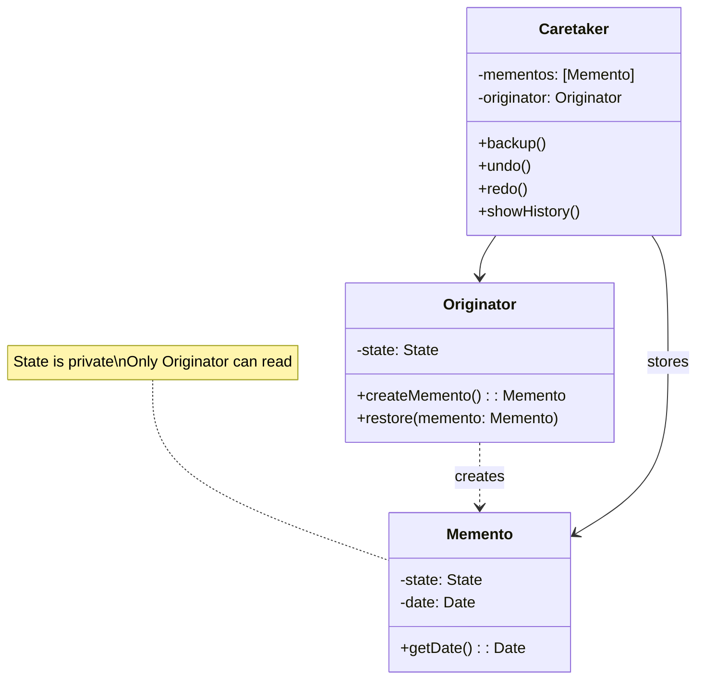

# Memento Pattern

## Intent

Without violating encapsulation, capture and externalize an object's internal state so that the object can be restored to this state later. The Memento pattern is essential for implementing undo/redo functionality, state persistence, and checkpointing in mobile applications.

## Problem

Mobile applications frequently need to save and restore state. Consider these scenarios:

- **Text Editor**: User wants to undo typing mistakes
- **Drawing App**: Artist needs to step back through brush strokes
- **Game**: Player wants to save progress and restore later
- **Form**: User accidentally navigates away and loses input
- **Photo Editor**: Photographer experiments with filters but wants to revert

Naive approaches expose internal state:

```swift
// Bad: Exposing internal state for saving
class Document {
    var text: String = ""
    var cursorPosition: Int = 0
    var selectionRange: Range<Int>?
    var formatting: [TextFormatting] = []
    
    // Exposing internals for external storage
    func getState() -> (String, Int, Range<Int>?, [TextFormatting]) {
        return (text, cursorPosition, selectionRange, formatting)
    }
    
    func setState(_ state: (String, Int, Range<Int>?, [TextFormatting])) {
        // Anyone can manipulate internal state!
        text = state.0
        cursorPosition = state.1
        selectionRange = state.2
        formatting = state.3
    }
}
```

This approach has problems:

1. **Encapsulation Violation**: Internal state is exposed publicly
2. **Fragile Code**: External code depends on internal structure
3. **Type Safety Issues**: Tuple-based state is error-prone
4. **No Validation**: State can be set to invalid combinations
5. **Maintenance Burden**: Changes require updating all save/restore code

## Solution

The Memento pattern introduces three participants:

1. **Originator**: The object whose state needs to be saved
2. **Memento**: A snapshot of the originator's state (opaque to others)
3. **Caretaker**: Manages mementos without examining their contents

## UML Diagram



## Swift Implementation

### Text Editor with Undo/Redo

```swift
import Foundation

// MARK: - Memento

struct TextEditorMemento {
    fileprivate let text: String
    fileprivate let cursorPosition: Int
    fileprivate let selectionRange: Range<Int>?
    fileprivate let timestamp: Date
    
    let name: String
    
    var date: Date { timestamp }
    
    fileprivate init(text: String, cursorPosition: Int, selectionRange: Range<Int>?, name: String) {
        self.text = text
        self.cursorPosition = cursorPosition
        self.selectionRange = selectionRange
        self.timestamp = Date()
        self.name = name
    }
}

// MARK: - Originator

final class TextEditor {
    private var text: String = ""
    private var cursorPosition: Int = 0
    private var selectionRange: Range<Int>?
    
    var currentText: String { text }
    var currentCursor: Int { cursorPosition }
    
    func type(_ newText: String) {
        if let range = selectionRange {
            // Replace selection
            let start = text.index(text.startIndex, offsetBy: range.lowerBound)
            let end = text.index(text.startIndex, offsetBy: range.upperBound)
            text.replaceSubrange(start..<end, with: newText)
            cursorPosition = range.lowerBound + newText.count
            selectionRange = nil
        } else {
            // Insert at cursor
            let index = text.index(text.startIndex, offsetBy: cursorPosition)
            text.insert(contentsOf: newText, at: index)
            cursorPosition += newText.count
        }
    }
    
    func delete() {
        if let range = selectionRange {
            let start = text.index(text.startIndex, offsetBy: range.lowerBound)
            let end = text.index(text.startIndex, offsetBy: range.upperBound)
            text.removeSubrange(start..<end)
            cursorPosition = range.lowerBound
            selectionRange = nil
        } else if cursorPosition > 0 {
            let index = text.index(text.startIndex, offsetBy: cursorPosition - 1)
            text.remove(at: index)
            cursorPosition -= 1
        }
    }
    
    func select(range: Range<Int>) {
        guard range.lowerBound >= 0 && range.upperBound <= text.count else { return }
        selectionRange = range
        cursorPosition = range.upperBound
    }
    
    func moveCursor(to position: Int) {
        guard position >= 0 && position <= text.count else { return }
        cursorPosition = position
        selectionRange = nil
    }
    
    // MARK: - Memento Methods
    
    func save(name: String = "Checkpoint") -> TextEditorMemento {
        return TextEditorMemento(
            text: text,
            cursorPosition: cursorPosition,
            selectionRange: selectionRange,
            name: name
        )
    }
    
    func restore(from memento: TextEditorMemento) {
        text = memento.text
        cursorPosition = memento.cursorPosition
        selectionRange = memento.selectionRange
    }
}

// MARK: - Caretaker

final class TextEditorHistory {
    private let editor: TextEditor
    private var undoStack: [TextEditorMemento] = []
    private var redoStack: [TextEditorMemento] = []
    private let maxHistorySize: Int
    
    var canUndo: Bool { !undoStack.isEmpty }
    var canRedo: Bool { !redoStack.isEmpty }
    
    init(editor: TextEditor, maxHistorySize: Int = 100) {
        self.editor = editor
        self.maxHistorySize = maxHistorySize
    }
    
    func checkpoint(name: String = "Edit") {
        let memento = editor.save(name: name)
        undoStack.append(memento)
        redoStack.removeAll() // Clear redo stack on new action
        
        // Limit history size
        if undoStack.count > maxHistorySize {
            undoStack.removeFirst()
        }
    }
    
    func undo() {
        guard let memento = undoStack.popLast() else { return }
        
        // Save current state for redo
        let currentState = editor.save(name: "Before Undo")
        redoStack.append(currentState)
        
        editor.restore(from: memento)
    }
    
    func redo() {
        guard let memento = redoStack.popLast() else { return }
        
        // Save current state for undo
        let currentState = editor.save(name: "Before Redo")
        undoStack.append(currentState)
        
        editor.restore(from: memento)
    }
    
    func getHistory() -> [String] {
        return undoStack.map { memento in
            let formatter = DateFormatter()
            formatter.timeStyle = .medium
            return "\(memento.name) - \(formatter.string(from: memento.date))"
        }
    }
    
    func clearHistory() {
        undoStack.removeAll()
        redoStack.removeAll()
    }
}
```

### Drawing Canvas Example

```swift
import UIKit

// MARK: - Drawing State

struct DrawingMemento {
    fileprivate let strokes: [Stroke]
    fileprivate let canvasSize: CGSize
    fileprivate let backgroundColor: UIColor
    fileprivate let timestamp: Date
    
    let description: String
    
    fileprivate init(strokes: [Stroke], canvasSize: CGSize, backgroundColor: UIColor, description: String) {
        self.strokes = strokes
        self.canvasSize = canvasSize
        self.backgroundColor = backgroundColor
        self.timestamp = Date()
        self.description = description
    }
}

struct Stroke {
    let points: [CGPoint]
    let color: UIColor
    let width: CGFloat
    let tool: DrawingTool
}

enum DrawingTool {
    case pen
    case pencil
    case brush
    case eraser
    case marker
}

// MARK: - Drawing Canvas (Originator)

final class DrawingCanvas: UIView {
    private var strokes: [Stroke] = []
    private var currentStroke: [CGPoint] = []
    
    var currentColor: UIColor = .black
    var currentWidth: CGFloat = 2.0
    var currentTool: DrawingTool = .pen
    
    var strokeCount: Int { strokes.count }
    
    override func draw(_ rect: CGRect) {
        guard let context = UIGraphicsGetCurrentContext() else { return }
        
        context.setFillColor(backgroundColor?.cgColor ?? UIColor.white.cgColor)
        context.fill(rect)
        
        for stroke in strokes {
            drawStroke(stroke, in: context)
        }
        
        // Draw current stroke being drawn
        if !currentStroke.isEmpty {
            let stroke = Stroke(
                points: currentStroke,
                color: currentColor,
                width: currentWidth,
                tool: currentTool
            )
            drawStroke(stroke, in: context)
        }
    }
    
    private func drawStroke(_ stroke: Stroke, in context: CGContext) {
        guard stroke.points.count > 1 else { return }
        
        context.setStrokeColor(stroke.color.cgColor)
        context.setLineWidth(stroke.width)
        context.setLineCap(.round)
        context.setLineJoin(.round)
        
        switch stroke.tool {
        case .eraser:
            context.setBlendMode(.clear)
        case .marker:
            context.setAlpha(0.5)
        default:
            context.setBlendMode(.normal)
            context.setAlpha(1.0)
        }
        
        context.beginPath()
        context.move(to: stroke.points[0])
        
        for i in 1..<stroke.points.count {
            context.addLine(to: stroke.points[i])
        }
        
        context.strokePath()
    }
    
    // MARK: - Touch Handling
    
    override func touchesBegan(_ touches: Set<UITouch>, with event: UIEvent?) {
        guard let touch = touches.first else { return }
        currentStroke = [touch.location(in: self)]
    }
    
    override func touchesMoved(_ touches: Set<UITouch>, with event: UIEvent?) {
        guard let touch = touches.first else { return }
        currentStroke.append(touch.location(in: self))
        setNeedsDisplay()
    }
    
    override func touchesEnded(_ touches: Set<UITouch>, with event: UIEvent?) {
        guard !currentStroke.isEmpty else { return }
        
        let stroke = Stroke(
            points: currentStroke,
            color: currentColor,
            width: currentWidth,
            tool: currentTool
        )
        strokes.append(stroke)
        currentStroke = []
        setNeedsDisplay()
    }
    
    func clearCanvas() {
        strokes.removeAll()
        setNeedsDisplay()
    }
    
    // MARK: - Memento Methods
    
    func save(description: String = "Drawing") -> DrawingMemento {
        return DrawingMemento(
            strokes: strokes,
            canvasSize: bounds.size,
            backgroundColor: backgroundColor ?? .white,
            description: description
        )
    }
    
    func restore(from memento: DrawingMemento) {
        strokes = memento.strokes
        backgroundColor = memento.backgroundColor
        setNeedsDisplay()
    }
}

// MARK: - Drawing History (Caretaker)

final class DrawingHistory {
    private let canvas: DrawingCanvas
    private var undoStack: [DrawingMemento] = []
    private var redoStack: [DrawingMemento] = []
    
    var canUndo: Bool { !undoStack.isEmpty }
    var canRedo: Bool { !redoStack.isEmpty }
    var historyCount: Int { undoStack.count }
    
    init(canvas: DrawingCanvas) {
        self.canvas = canvas
        // Save initial empty state
        checkpoint(description: "New Canvas")
    }
    
    func checkpoint(description: String = "Stroke") {
        let memento = canvas.save(description: description)
        undoStack.append(memento)
        redoStack.removeAll()
    }
    
    func undo() {
        guard undoStack.count > 1 else { return } // Keep at least initial state
        
        let current = undoStack.removeLast()
        redoStack.append(current)
        
        if let previous = undoStack.last {
            canvas.restore(from: previous)
        }
    }
    
    func redo() {
        guard let memento = redoStack.popLast() else { return }
        undoStack.append(memento)
        canvas.restore(from: memento)
    }
    
    func jumpTo(index: Int) {
        guard index >= 0 && index < undoStack.count else { return }
        
        // Move states after index to redo stack
        while undoStack.count > index + 1 {
            if let memento = undoStack.popLast() {
                redoStack.insert(memento, at: 0)
            }
        }
        
        if let memento = undoStack.last {
            canvas.restore(from: memento)
        }
    }
    
    func exportHistory() -> Data? {
        // Serialize for persistence
        // Implementation depends on requirements
        return nil
    }
}
```

## Kotlin Implementation

```kotlin
import java.util.*

// Memento - immutable snapshot
data class EditorMemento internal constructor(
    internal val content: String,
    internal val cursorPosition: Int,
    internal val selection: IntRange?,
    val timestamp: Date = Date(),
    val name: String = "Snapshot"
)

// Originator
class TextEditor {
    private var content: String = ""
    private var cursorPosition: Int = 0
    private var selection: IntRange? = null
    
    val currentContent: String get() = content
    val currentCursor: Int get() = cursorPosition
    
    fun type(text: String) {
        selection?.let { range ->
            content = content.replaceRange(range, text)
            cursorPosition = range.first + text.length
            selection = null
        } ?: run {
            content = content.substring(0, cursorPosition) + 
                      text + 
                      content.substring(cursorPosition)
            cursorPosition += text.length
        }
    }
    
    fun delete() {
        selection?.let { range ->
            content = content.removeRange(range)
            cursorPosition = range.first
            selection = null
        } ?: run {
            if (cursorPosition > 0) {
                content = content.removeRange(cursorPosition - 1, cursorPosition)
                cursorPosition--
            }
        }
    }
    
    fun select(range: IntRange) {
        if (range.first >= 0 && range.last < content.length) {
            selection = range
            cursorPosition = range.last + 1
        }
    }
    
    fun moveCursor(position: Int) {
        if (position in 0..content.length) {
            cursorPosition = position
            selection = null
        }
    }
    
    // Memento methods
    fun save(name: String = "Checkpoint"): EditorMemento {
        return EditorMemento(
            content = content,
            cursorPosition = cursorPosition,
            selection = selection,
            name = name
        )
    }
    
    fun restore(memento: EditorMemento) {
        content = memento.content
        cursorPosition = memento.cursorPosition
        selection = memento.selection
    }
}

// Caretaker
class EditorHistory(
    private val editor: TextEditor,
    private val maxSize: Int = 100
) {
    private val undoStack = ArrayDeque<EditorMemento>()
    private val redoStack = ArrayDeque<EditorMemento>()
    
    val canUndo: Boolean get() = undoStack.isNotEmpty()
    val canRedo: Boolean get() = redoStack.isNotEmpty()
    
    fun checkpoint(name: String = "Edit") {
        undoStack.push(editor.save(name))
        redoStack.clear()
        
        while (undoStack.size > maxSize) {
            undoStack.removeLast()
        }
    }
    
    fun undo() {
        if (undoStack.isEmpty()) return
        
        redoStack.push(editor.save("Before Undo"))
        val memento = undoStack.pop()
        editor.restore(memento)
    }
    
    fun redo() {
        if (redoStack.isEmpty()) return
        
        undoStack.push(editor.save("Before Redo"))
        val memento = redoStack.pop()
        editor.restore(memento)
    }
    
    fun getHistory(): List<String> {
        return undoStack.map { "${it.name} - ${it.timestamp}" }
    }
}

// Usage
fun main() {
    val editor = TextEditor()
    val history = EditorHistory(editor)
    
    history.checkpoint("Initial")
    
    editor.type("Hello")
    history.checkpoint("Typed Hello")
    
    editor.type(" World")
    history.checkpoint("Typed World")
    
    println(editor.currentContent) // "Hello World"
    
    history.undo()
    println(editor.currentContent) // "Hello"
    
    history.redo()
    println(editor.currentContent) // "Hello World"
}
```

## Game Save System

A practical example for mobile games:

```swift
import Foundation

// MARK: - Game State Memento

struct GameSaveMemento: Codable {
    fileprivate let playerState: PlayerState
    fileprivate let worldState: WorldState
    fileprivate let inventoryState: InventoryState
    fileprivate let questState: QuestState
    fileprivate let timestamp: Date
    
    let saveName: String
    let playTime: TimeInterval
    let thumbnailData: Data?
    
    var date: Date { timestamp }
    
    struct PlayerState: Codable {
        let health: Int
        let maxHealth: Int
        let mana: Int
        let maxMana: Int
        let level: Int
        let experience: Int
        let position: Position
    }
    
    struct Position: Codable {
        let x: Float
        let y: Float
        let z: Float
        let mapId: String
    }
    
    struct WorldState: Codable {
        let unlockedAreas: Set<String>
        let defeatedBosses: Set<String>
        let discoveredSecrets: Set<String>
        let worldTime: TimeInterval
    }
    
    struct InventoryState: Codable {
        let items: [String: Int]
        let equippedWeapon: String?
        let equippedArmor: String?
        let gold: Int
    }
    
    struct QuestState: Codable {
        let activeQuests: [String]
        let completedQuests: [String]
        let questProgress: [String: Int]
    }
}

// MARK: - Game (Originator)

final class Game {
    // Player stats
    private var health: Int = 100
    private var maxHealth: Int = 100
    private var mana: Int = 50
    private var maxMana: Int = 50
    private var level: Int = 1
    private var experience: Int = 0
    private var position: GameSaveMemento.Position = .init(x: 0, y: 0, z: 0, mapId: "starting_zone")
    
    // World state
    private var unlockedAreas: Set<String> = ["starting_zone"]
    private var defeatedBosses: Set<String> = []
    private var discoveredSecrets: Set<String> = []
    private var worldTime: TimeInterval = 0
    
    // Inventory
    private var items: [String: Int] = ["health_potion": 3]
    private var equippedWeapon: String? = "wooden_sword"
    private var equippedArmor: String? = nil
    private var gold: Int = 100
    
    // Quests
    private var activeQuests: [String] = ["tutorial_quest"]
    private var completedQuests: [String] = []
    private var questProgress: [String: Int] = ["tutorial_quest": 0]
    
    // Game time tracking
    private var sessionStartTime: Date = Date()
    private var totalPlayTime: TimeInterval = 0
    
    // MARK: - Game Actions
    
    func takeDamage(_ amount: Int) {
        health = max(0, health - amount)
    }
    
    func heal(_ amount: Int) {
        health = min(maxHealth, health + amount)
    }
    
    func gainExperience(_ amount: Int) {
        experience += amount
        checkLevelUp()
    }
    
    private func checkLevelUp() {
        let requiredExp = level * 100
        if experience >= requiredExp {
            level += 1
            experience -= requiredExp
            maxHealth += 10
            maxMana += 5
            health = maxHealth
            mana = maxMana
        }
    }
    
    func moveTo(x: Float, y: Float, z: Float) {
        position = GameSaveMemento.Position(x: x, y: y, z: z, mapId: position.mapId)
    }
    
    func enterArea(_ areaId: String) {
        unlockedAreas.insert(areaId)
        position = GameSaveMemento.Position(x: 0, y: 0, z: 0, mapId: areaId)
    }
    
    func defeatBoss(_ bossId: String) {
        defeatedBosses.insert(bossId)
        gainExperience(500)
    }
    
    func addItem(_ itemId: String, count: Int = 1) {
        items[itemId, default: 0] += count
    }
    
    func completeQuest(_ questId: String) {
        activeQuests.removeAll { $0 == questId }
        completedQuests.append(questId)
    }
    
    // MARK: - Memento Methods
    
    func save(name: String, thumbnail: Data? = nil) -> GameSaveMemento {
        let currentPlayTime = totalPlayTime + Date().timeIntervalSince(sessionStartTime)
        
        return GameSaveMemento(
            playerState: GameSaveMemento.PlayerState(
                health: health,
                maxHealth: maxHealth,
                mana: mana,
                maxMana: maxMana,
                level: level,
                experience: experience,
                position: position
            ),
            worldState: GameSaveMemento.WorldState(
                unlockedAreas: unlockedAreas,
                defeatedBosses: defeatedBosses,
                discoveredSecrets: discoveredSecrets,
                worldTime: worldTime
            ),
            inventoryState: GameSaveMemento.InventoryState(
                items: items,
                equippedWeapon: equippedWeapon,
                equippedArmor: equippedArmor,
                gold: gold
            ),
            questState: GameSaveMemento.QuestState(
                activeQuests: activeQuests,
                completedQuests: completedQuests,
                questProgress: questProgress
            ),
            timestamp: Date(),
            saveName: name,
            playTime: currentPlayTime,
            thumbnailData: thumbnail
        )
    }
    
    func restore(from memento: GameSaveMemento) {
        // Restore player state
        health = memento.playerState.health
        maxHealth = memento.playerState.maxHealth
        mana = memento.playerState.mana
        maxMana = memento.playerState.maxMana
        level = memento.playerState.level
        experience = memento.playerState.experience
        position = memento.playerState.position
        
        // Restore world state
        unlockedAreas = memento.worldState.unlockedAreas
        defeatedBosses = memento.worldState.defeatedBosses
        discoveredSecrets = memento.worldState.discoveredSecrets
        worldTime = memento.worldState.worldTime
        
        // Restore inventory
        items = memento.inventoryState.items
        equippedWeapon = memento.inventoryState.equippedWeapon
        equippedArmor = memento.inventoryState.equippedArmor
        gold = memento.inventoryState.gold
        
        // Restore quests
        activeQuests = memento.questState.activeQuests
        completedQuests = memento.questState.completedQuests
        questProgress = memento.questState.questProgress
        
        // Reset session timer
        totalPlayTime = memento.playTime
        sessionStartTime = Date()
    }
}

// MARK: - Save Manager (Caretaker)

final class GameSaveManager {
    private let game: Game
    private let saveDirectory: URL
    private let maxSaveSlots: Int
    
    private var saveSlots: [Int: GameSaveMemento] = [:]
    private var autoSaveMemento: GameSaveMemento?
    
    init(game: Game, maxSaveSlots: Int = 10) {
        self.game = game
        self.maxSaveSlots = maxSaveSlots
        
        let documents = FileManager.default.urls(for: .documentDirectory, in: .userDomainMask)[0]
        self.saveDirectory = documents.appendingPathComponent("Saves")
        
        try? FileManager.default.createDirectory(at: saveDirectory, withIntermediateDirectories: true)
        loadSaveIndex()
    }
    
    // MARK: - Save Operations
    
    func saveToSlot(_ slot: Int, name: String) -> Bool {
        guard slot >= 0 && slot < maxSaveSlots else { return false }
        
        let memento = game.save(name: name)
        saveSlots[slot] = memento
        
        return persistMemento(memento, filename: "slot_\(slot).save")
    }
    
    func loadFromSlot(_ slot: Int) -> Bool {
        guard let memento = saveSlots[slot] else { return false }
        game.restore(from: memento)
        return true
    }
    
    func autoSave() {
        autoSaveMemento = game.save(name: "Auto Save")
        persistMemento(autoSaveMemento!, filename: "autosave.save")
    }
    
    func loadAutoSave() -> Bool {
        guard let memento = autoSaveMemento else { return false }
        game.restore(from: memento)
        return true
    }
    
    func deleteSlot(_ slot: Int) {
        saveSlots.removeValue(forKey: slot)
        let url = saveDirectory.appendingPathComponent("slot_\(slot).save")
        try? FileManager.default.removeItem(at: url)
    }
    
    func getSaveInfo(slot: Int) -> (name: String, date: Date, playTime: TimeInterval)? {
        guard let memento = saveSlots[slot] else { return nil }
        return (memento.saveName, memento.date, memento.playTime)
    }
    
    func getAllSaves() -> [(slot: Int, name: String, date: Date)] {
        return saveSlots.map { ($0.key, $0.value.saveName, $0.value.date) }
            .sorted { $0.date > $1.date }
    }
    
    // MARK: - Persistence
    
    private func persistMemento(_ memento: GameSaveMemento, filename: String) -> Bool {
        let url = saveDirectory.appendingPathComponent(filename)
        
        do {
            let data = try JSONEncoder().encode(memento)
            try data.write(to: url)
            return true
        } catch {
            print("Failed to save: \(error)")
            return false
        }
    }
    
    private func loadSaveIndex() {
        for slot in 0..<maxSaveSlots {
            let url = saveDirectory.appendingPathComponent("slot_\(slot).save")
            if let data = try? Data(contentsOf: url),
               let memento = try? JSONDecoder().decode(GameSaveMemento.self, from: data) {
                saveSlots[slot] = memento
            }
        }
        
        let autoSaveURL = saveDirectory.appendingPathComponent("autosave.save")
        if let data = try? Data(contentsOf: autoSaveURL),
           let memento = try? JSONDecoder().decode(GameSaveMemento.self, from: data) {
            autoSaveMemento = memento
        }
    }
}
```

## When to Use

| Scenario | Memento Fits? |
|----------|---------------|
| Undo/Redo functionality | ✅ Perfect |
| Game save systems | ✅ Perfect |
| Form state preservation | ✅ Good fit |
| Transaction rollback | ✅ Good fit |
| Simple property changes | ❌ Overkill |
| Real-time streaming data | ❌ Not suitable |

## Advantages

1. **Encapsulation Preserved**: Internal state stays private
2. **Simplified Originator**: No history management burden
3. **Recovery Support**: Easy rollback to previous states
4. **Snapshot History**: Multiple restore points available

## Disadvantages

1. **Memory Usage**: Storing many mementos consumes memory
2. **Serialization Cost**: Large states expensive to copy
3. **Maintenance**: Memento must match originator changes
4. **No Partial Restore**: All-or-nothing state restoration

## Related Patterns

- **Command**: Commands can store mementos for undo
- **Prototype**: Mementos are essentially state prototypes
- **State**: Different pattern despite similar name

## Best Practices

1. Use `fileprivate` or nested types for memento state access
2. Implement `Codable` for persistent mementos
3. Consider compression for large state objects
4. Limit history size to prevent memory issues
5. Use incremental mementos for large state objects
6. Make mementos immutable
