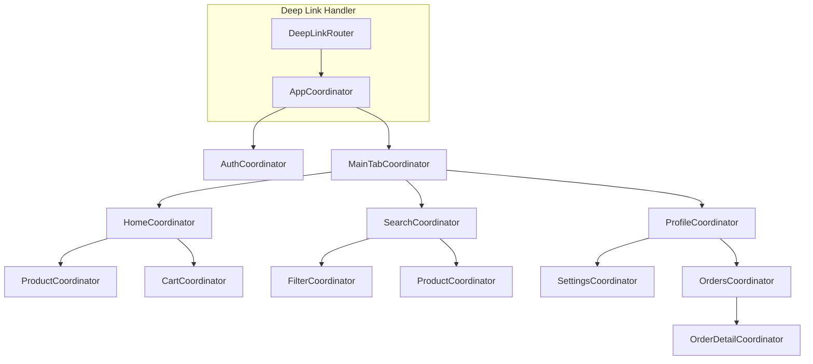

# Advanced Coordinator Pattern

## Introduction

The Coordinator pattern is a navigation architecture pattern that removes navigation responsibility from view controllers. While the basic pattern is straightforward, real-world mobile applications require advanced techniques for handling complex navigation flows, deep linking, state restoration, and multi-module architectures.

This guide covers advanced coordinator implementations for production-grade iOS and Android applications.

## Basic Coordinator Recap

```swift
protocol Coordinator: AnyObject {
    var childCoordinators: [Coordinator] { get set }
    var navigationController: UINavigationController { get }
    func start()
}
```

The basic pattern works well for simple apps, but complex applications need more sophisticated solutions.

## Advanced Architecture



## Protocol-Oriented Coordinator System

### Core Protocols

```swift
import UIKit
import Combine

// MARK: - Core Protocols

protocol Coordinator: AnyObject {
    var identifier: UUID { get }
    var childCoordinators: [UUID: Coordinator] { get set }
    var parentCoordinator: Coordinator? { get set }
    
    func start()
    func start(with deepLink: DeepLink?)
    func finish()
    func childDidFinish(_ child: Coordinator)
}

protocol NavigatingCoordinator: Coordinator {
    var navigationController: UINavigationController { get }
}

protocol PresentingCoordinator: Coordinator {
    var rootViewController: UIViewController { get }
}

protocol TabCoordinator: Coordinator {
    var tabBarController: UITabBarController { get }
    var tabs: [NavigatingCoordinator] { get }
}

// MARK: - Default Implementations

extension Coordinator {
    func start(with deepLink: DeepLink?) {
        start()
        if let deepLink = deepLink {
            handle(deepLink: deepLink)
        }
    }
    
    func addChild(_ coordinator: Coordinator) {
        childCoordinators[coordinator.identifier] = coordinator
        coordinator.parentCoordinator = self
    }
    
    func removeChild(_ coordinator: Coordinator) {
        childCoordinators.removeValue(forKey: coordinator.identifier)
    }
    
    func childDidFinish(_ child: Coordinator) {
        removeChild(child)
    }
    
    func finish() {
        childCoordinators.values.forEach { $0.finish() }
        childCoordinators.removeAll()
        parentCoordinator?.childDidFinish(self)
    }
    
    func handle(deepLink: DeepLink) {
        // Override in subclasses
    }
}
```

### Routable Protocol for Type-Safe Navigation

```swift
// MARK: - Route System

protocol Route {
    var path: String { get }
}

protocol Routable: Coordinator {
    associatedtype RouteType: Route
    func navigate(to route: RouteType)
    func canHandle(route: RouteType) -> Bool
}

extension Routable {
    func canHandle(route: RouteType) -> Bool {
        return true
    }
}

// MARK: - Concrete Routes

enum AppRoute: Route {
    case auth(AuthRoute)
    case main(MainRoute)
    case deepLink(DeepLink)
    
    var path: String {
        switch self {
        case .auth(let route): return "auth/\(route.path)"
        case .main(let route): return "main/\(route.path)"
        case .deepLink(let link): return link.path
        }
    }
}

enum AuthRoute: Route {
    case login
    case register
    case forgotPassword
    case verification(email: String)
    case onboarding
    
    var path: String {
        switch self {
        case .login: return "login"
        case .register: return "register"
        case .forgotPassword: return "forgot-password"
        case .verification: return "verification"
        case .onboarding: return "onboarding"
        }
    }
}

enum MainRoute: Route {
    case home(HomeRoute)
    case search(SearchRoute)
    case profile(ProfileRoute)
    case cart
    
    var path: String {
        switch self {
        case .home(let route): return "home/\(route.path)"
        case .search(let route): return "search/\(route.path)"
        case .profile(let route): return "profile/\(route.path)"
        case .cart: return "cart"
        }
    }
}

enum HomeRoute: Route {
    case feed
    case product(id: String)
    case category(id: String)
    case promotion(id: String)
    
    var path: String {
        switch self {
        case .feed: return "feed"
        case .product(let id): return "product/\(id)"
        case .category(let id): return "category/\(id)"
        case .promotion(let id): return "promotion/\(id)"
        }
    }
}

enum SearchRoute: Route {
    case search(query: String?)
    case filters
    case results(query: String)
    
    var path: String {
        switch self {
        case .search: return "search"
        case .filters: return "filters"
        case .results(let query): return "results/\(query)"
        }
    }
}

enum ProfileRoute: Route {
    case overview
    case settings
    case orders
    case orderDetail(id: String)
    case addresses
    case payment
    case notifications
    
    var path: String {
        switch self {
        case .overview: return "overview"
        case .settings: return "settings"
        case .orders: return "orders"
        case .orderDetail(let id): return "order/\(id)"
        case .addresses: return "addresses"
        case .payment: return "payment"
        case .notifications: return "notifications"
        }
    }
}
```

## Deep Linking System

```swift
// MARK: - Deep Link Types

struct DeepLink {
    let path: String
    let parameters: [String: String]
    let source: DeepLinkSource
    
    enum DeepLinkSource {
        case url
        case push
        case shortcut
        case spotlight
        case widget
        case handoff
    }
}

// MARK: - Deep Link Parser

final class DeepLinkParser {
    
    private let scheme: String
    private let host: String
    
    init(scheme: String = "myapp", host: String = "app.example.com") {
        self.scheme = scheme
        self.host = host
    }
    
    func parse(url: URL) -> DeepLink? {
        // Handle custom scheme: myapp://product/123
        if url.scheme == scheme {
            return parseCustomScheme(url)
        }
        
        // Handle universal links: https://app.example.com/product/123
        if url.host == host {
            return parseUniversalLink(url)
        }
        
        return nil
    }
    
    func parse(userActivity: NSUserActivity) -> DeepLink? {
        if userActivity.activityType == NSUserActivityTypeBrowsingWeb,
           let url = userActivity.webpageURL {
            var deepLink = parse(url: url)
            deepLink = deepLink.map {
                DeepLink(path: $0.path, parameters: $0.parameters, source: .handoff)
            }
            return deepLink
        }
        
        // Spotlight
        if userActivity.activityType == "com.example.app.product" {
            if let productId = userActivity.userInfo?["productId"] as? String {
                return DeepLink(
                    path: "product/\(productId)",
                    parameters: [:],
                    source: .spotlight
                )
            }
        }
        
        return nil
    }
    
    func parse(shortcutItem: UIApplicationShortcutItem) -> DeepLink? {
        switch shortcutItem.type {
        case "com.example.app.search":
            return DeepLink(path: "search", parameters: [:], source: .shortcut)
        case "com.example.app.cart":
            return DeepLink(path: "cart", parameters: [:], source: .shortcut)
        case "com.example.app.orders":
            return DeepLink(path: "profile/orders", parameters: [:], source: .shortcut)
        default:
            return nil
        }
    }
    
    func parse(pushNotification: [AnyHashable: Any]) -> DeepLink? {
        guard let aps = pushNotification["aps"] as? [String: Any],
              let category = aps["category"] as? String else {
            return nil
        }
        
        var parameters: [String: String] = [:]
        
        if let data = pushNotification["data"] as? [String: String] {
            parameters = data
        }
        
        let path: String
        switch category {
        case "ORDER_UPDATE":
            path = "profile/order/\(parameters["orderId"] ?? "")"
        case "PROMOTION":
            path = "home/promotion/\(parameters["promoId"] ?? "")"
        case "MESSAGE":
            path = "messages/\(parameters["conversationId"] ?? "")"
        default:
            return nil
        }
        
        return DeepLink(path: path, parameters: parameters, source: .push)
    }
    
    private func parseCustomScheme(_ url: URL) -> DeepLink? {
        let path = url.host ?? "" + url.path
        let parameters = parseQueryParameters(url)
        return DeepLink(path: path, parameters: parameters, source: .url)
    }
    
    private func parseUniversalLink(_ url: URL) -> DeepLink? {
        let path = String(url.path.dropFirst()) // Remove leading /
        let parameters = parseQueryParameters(url)
        return DeepLink(path: path, parameters: parameters, source: .url)
    }
    
    private func parseQueryParameters(_ url: URL) -> [String: String] {
        guard let components = URLComponents(url: url, resolvingAgainstBaseURL: false),
              let queryItems = components.queryItems else {
            return [:]
        }
        
        return queryItems.reduce(into: [:]) { result, item in
            result[item.name] = item.value
        }
    }
}

// MARK: - Deep Link Router

final class DeepLinkRouter {
    
    private weak var appCoordinator: AppCoordinator?
    private let parser: DeepLinkParser
    
    private var pendingDeepLink: DeepLink?
    
    init(appCoordinator: AppCoordinator, parser: DeepLinkParser = DeepLinkParser()) {
        self.appCoordinator = appCoordinator
        self.parser = parser
    }
    
    func handle(url: URL) -> Bool {
        guard let deepLink = parser.parse(url: url) else { return false }
        return route(deepLink)
    }
    
    func handle(userActivity: NSUserActivity) -> Bool {
        guard let deepLink = parser.parse(userActivity: userActivity) else { return false }
        return route(deepLink)
    }
    
    func handle(shortcutItem: UIApplicationShortcutItem) -> Bool {
        guard let deepLink = parser.parse(shortcutItem: shortcutItem) else { return false }
        return route(deepLink)
    }
    
    func handle(pushNotification: [AnyHashable: Any]) -> Bool {
        guard let deepLink = parser.parse(pushNotification: pushNotification) else { return false }
        return route(deepLink)
    }
    
    func setPendingDeepLink(_ deepLink: DeepLink) {
        pendingDeepLink = deepLink
    }
    
    func processPendingDeepLink() {
        guard let deepLink = pendingDeepLink else { return }
        pendingDeepLink = nil
        route(deepLink)
    }
    
    @discardableResult
    private func route(_ deepLink: DeepLink) -> Bool {
        guard let coordinator = appCoordinator else { return false }
        
        // Check if app is ready for deep linking
        guard coordinator.isReady else {
            pendingDeepLink = deepLink
            return true
        }
        
        // Parse path components
        let components = deepLink.path.split(separator: "/").map(String.init)
        guard !components.isEmpty else { return false }
        
        // Route based on first component
        switch components[0] {
        case "product":
            if components.count > 1 {
                coordinator.navigate(to: .main(.home(.product(id: components[1]))))
                return true
            }
            
        case "category":
            if components.count > 1 {
                coordinator.navigate(to: .main(.home(.category(id: components[1]))))
                return true
            }
            
        case "search":
            let query = deepLink.parameters["q"]
            coordinator.navigate(to: .main(.search(.search(query: query))))
            return true
            
        case "cart":
            coordinator.navigate(to: .main(.cart))
            return true
            
        case "profile":
            if components.count > 1 {
                switch components[1] {
                case "orders":
                    coordinator.navigate(to: .main(.profile(.orders)))
                case "order" where components.count > 2:
                    coordinator.navigate(to: .main(.profile(.orderDetail(id: components[2]))))
                case "settings":
                    coordinator.navigate(to: .main(.profile(.settings)))
                default:
                    coordinator.navigate(to: .main(.profile(.overview)))
                }
            } else {
                coordinator.navigate(to: .main(.profile(.overview)))
            }
            return true
            
        case "home":
            if components.count > 1 && components[1] == "promotion" && components.count > 2 {
                coordinator.navigate(to: .main(.home(.promotion(id: components[2]))))
                return true
            }
            coordinator.navigate(to: .main(.home(.feed)))
            return true
            
        case "auth":
            if components.count > 1 {
                switch components[1] {
                case "login":
                    coordinator.navigate(to: .auth(.login))
                case "register":
                    coordinator.navigate(to: .auth(.register))
                default:
                    break
                }
            }
            return true
            
        default:
            break
        }
        
        return false
    }
}
```

## State Restoration

```swift
// MARK: - Coordinator State

protocol StatefulCoordinator: Coordinator {
    var state: CoordinatorState { get }
    func restore(from state: CoordinatorState)
}

struct CoordinatorState: Codable {
    let identifier: String
    let type: String
    let data: [String: AnyCodable]
    let childStates: [CoordinatorState]
    let timestamp: Date
    
    init(
        identifier: String,
        type: String,
        data: [String: AnyCodable] = [:],
        childStates: [CoordinatorState] = []
    ) {
        self.identifier = identifier
        self.type = type
        self.data = data
        self.childStates = childStates
        self.timestamp = Date()
    }
}

// Type-erased Codable wrapper
struct AnyCodable: Codable {
    let value: Any
    
    init(_ value: Any) {
        self.value = value
    }
    
    init(from decoder: Decoder) throws {
        let container = try decoder.singleValueContainer()
        
        if let bool = try? container.decode(Bool.self) {
            value = bool
        } else if let int = try? container.decode(Int.self) {
            value = int
        } else if let double = try? container.decode(Double.self) {
            value = double
        } else if let string = try? container.decode(String.self) {
            value = string
        } else if let array = try? container.decode([AnyCodable].self) {
            value = array.map(\.value)
        } else if let dict = try? container.decode([String: AnyCodable].self) {
            value = dict.mapValues(\.value)
        } else {
            value = NSNull()
        }
    }
    
    func encode(to encoder: Encoder) throws {
        var container = encoder.singleValueContainer()
        
        switch value {
        case let bool as Bool:
            try container.encode(bool)
        case let int as Int:
            try container.encode(int)
        case let double as Double:
            try container.encode(double)
        case let string as String:
            try container.encode(string)
        case let array as [Any]:
            try container.encode(array.map(AnyCodable.init))
        case let dict as [String: Any]:
            try container.encode(dict.mapValues(AnyCodable.init))
        default:
            try container.encodeNil()
        }
    }
}

// MARK: - State Restoration Manager

final class StateRestorationManager {
    
    private let userDefaults: UserDefaults
    private let stateKey = "app.coordinator.state"
    
    init(userDefaults: UserDefaults = .standard) {
        self.userDefaults = userDefaults
    }
    
    func save(_ state: CoordinatorState) {
        do {
            let data = try JSONEncoder().encode(state)
            userDefaults.set(data, forKey: stateKey)
        } catch {
            print("Failed to save state: \(error)")
        }
    }
    
    func loadState() -> CoordinatorState? {
        guard let data = userDefaults.data(forKey: stateKey) else { return nil }
        
        do {
            return try JSONDecoder().decode(CoordinatorState.self, from: data)
        } catch {
            print("Failed to load state: \(error)")
            return nil
        }
    }
    
    func clearState() {
        userDefaults.removeObject(forKey: stateKey)
    }
    
    func shouldRestore() -> Bool {
        guard let state = loadState() else { return false }
        
        // Don't restore if state is too old (e.g., > 24 hours)
        let maxAge: TimeInterval = 24 * 60 * 60
        return Date().timeIntervalSince(state.timestamp) < maxAge
    }
}
```

## Dependency Injection with Coordinators

```swift
// MARK: - Dependency Container

protocol DependencyContainer {
    var networkService: NetworkServiceProtocol { get }
    var authService: AuthServiceProtocol { get }
    var storageService: StorageServiceProtocol { get }
    var analyticsService: AnalyticsServiceProtocol { get }
}

final class AppDependencyContainer: DependencyContainer {
    lazy var networkService: NetworkServiceProtocol = NetworkService()
    lazy var authService: AuthServiceProtocol = AuthService(network: networkService)
    lazy var storageService: StorageServiceProtocol = StorageService()
    lazy var analyticsService: AnalyticsServiceProtocol = AnalyticsService()
}

// MARK: - Coordinator Factory

protocol CoordinatorFactory {
    func makeAuthCoordinator(navigationController: UINavigationController) -> AuthCoordinator
    func makeMainTabCoordinator() -> MainTabCoordinator
    func makeHomeCoordinator(navigationController: UINavigationController) -> HomeCoordinator
    func makeSearchCoordinator(navigationController: UINavigationController) -> SearchCoordinator
    func makeProfileCoordinator(navigationController: UINavigationController) -> ProfileCoordinator
    func makeProductCoordinator(productId: String, navigationController: UINavigationController) -> ProductCoordinator
}

final class DefaultCoordinatorFactory: CoordinatorFactory {
    
    private let container: DependencyContainer
    
    init(container: DependencyContainer) {
        self.container = container
    }
    
    func makeAuthCoordinator(navigationController: UINavigationController) -> AuthCoordinator {
        return AuthCoordinator(
            navigationController: navigationController,
            authService: container.authService,
            analytics: container.analyticsService
        )
    }
    
    func makeMainTabCoordinator() -> MainTabCoordinator {
        return MainTabCoordinator(factory: self)
    }
    
    func makeHomeCoordinator(navigationController: UINavigationController) -> HomeCoordinator {
        return HomeCoordinator(
            navigationController: navigationController,
            factory: self,
            networkService: container.networkService,
            analytics: container.analyticsService
        )
    }
    
    func makeSearchCoordinator(navigationController: UINavigationController) -> SearchCoordinator {
        return SearchCoordinator(
            navigationController: navigationController,
            factory: self,
            networkService: container.networkService
        )
    }
    
    func makeProfileCoordinator(navigationController: UINavigationController) -> ProfileCoordinator {
        return ProfileCoordinator(
            navigationController: navigationController,
            factory: self,
            authService: container.authService,
            storageService: container.storageService
        )
    }
    
    func makeProductCoordinator(productId: String, navigationController: UINavigationController) -> ProductCoordinator {
        return ProductCoordinator(
            productId: productId,
            navigationController: navigationController,
            networkService: container.networkService,
            analytics: container.analyticsService
        )
    }
}
```

## Complete App Coordinator

```swift
// MARK: - App Coordinator

final class AppCoordinator: Coordinator, Routable {
    typealias RouteType = AppRoute
    
    let identifier = UUID()
    var childCoordinators: [UUID: Coordinator] = [:]
    weak var parentCoordinator: Coordinator?
    
    private let window: UIWindow
    private let factory: CoordinatorFactory
    private let authService: AuthServiceProtocol
    private let deepLinkRouter: DeepLinkRouter
    private let stateManager: StateRestorationManager
    
    private(set) var isReady = false
    
    private var cancellables = Set<AnyCancellable>()
    
    init(
        window: UIWindow,
        factory: CoordinatorFactory,
        authService: AuthServiceProtocol
    ) {
        self.window = window
        self.factory = factory
        self.authService = authService
        self.deepLinkRouter = DeepLinkRouter(appCoordinator: nil, parser: DeepLinkParser())
        self.stateManager = StateRestorationManager()
    }
    
    func start() {
        // Observe auth state changes
        authService.authStatePublisher
            .receive(on: DispatchQueue.main)
            .sink { [weak self] state in
                self?.handleAuthStateChange(state)
            }
            .store(in: &cancellables)
        
        // Check if we should restore state
        if stateManager.shouldRestore(), let state = stateManager.loadState() {
            restore(from: state)
        } else {
            // Normal start
            if authService.isAuthenticated {
                showMain()
            } else {
                showAuth()
            }
        }
        
        window.makeKeyAndVisible()
        isReady = true
        
        // Process any pending deep links
        deepLinkRouter.processPendingDeepLink()
    }
    
    func navigate(to route: AppRoute) {
        switch route {
        case .auth(let authRoute):
            showAuth(with: authRoute)
        case .main(let mainRoute):
            showMain(with: mainRoute)
        case .deepLink(let deepLink):
            handle(deepLink: deepLink)
        }
    }
    
    func canHandle(route: AppRoute) -> Bool {
        return true
    }
    
    override func handle(deepLink: DeepLink) {
        deepLinkRouter.route(deepLink)
    }
    
    // MARK: - Private Methods
    
    private func handleAuthStateChange(_ state: AuthState) {
        switch state {
        case .authenticated:
            showMain()
        case .unauthenticated:
            showAuth()
        case .requiresVerification(let email):
            showAuth(with: .verification(email: email))
        }
    }
    
    private func showAuth(with route: AuthRoute = .login) {
        // Remove existing coordinators
        childCoordinators.values.forEach { $0.finish() }
        childCoordinators.removeAll()
        
        let navigationController = UINavigationController()
        let authCoordinator = factory.makeAuthCoordinator(navigationController: navigationController)
        
        authCoordinator.onComplete = { [weak self] in
            self?.showMain()
        }
        
        addChild(authCoordinator)
        authCoordinator.start()
        authCoordinator.navigate(to: route)
        
        window.rootViewController = navigationController
    }
    
    private func showMain(with route: MainRoute? = nil) {
        // Remove existing coordinators
        childCoordinators.values.forEach { $0.finish() }
        childCoordinators.removeAll()
        
        let mainCoordinator = factory.makeMainTabCoordinator()
        
        addChild(mainCoordinator)
        mainCoordinator.start()
        
        if let route = route {
            mainCoordinator.navigate(to: route)
        }
        
        window.rootViewController = mainCoordinator.tabBarController
    }
    
    private func restore(from state: CoordinatorState) {
        // Restore based on saved state type
        switch state.type {
        case "auth":
            showAuth()
        case "main":
            showMain()
            // Restore child states
            if let mainCoordinator = childCoordinators.values.first as? StatefulCoordinator {
                for childState in state.childStates {
                    mainCoordinator.restore(from: childState)
                }
            }
        default:
            start()
        }
    }
    
    func saveState() {
        var childStates: [CoordinatorState] = []
        
        for coordinator in childCoordinators.values {
            if let stateful = coordinator as? StatefulCoordinator {
                childStates.append(stateful.state)
            }
        }
        
        let state = CoordinatorState(
            identifier: identifier.uuidString,
            type: authService.isAuthenticated ? "main" : "auth",
            childStates: childStates
        )
        
        stateManager.save(state)
    }
}
```

## Kotlin Implementation

```kotlin
// Core interfaces
interface Coordinator {
    val id: String
    val childCoordinators: MutableMap<String, Coordinator>
    var parentCoordinator: Coordinator?
    
    fun start()
    fun finish()
    
    fun addChild(coordinator: Coordinator) {
        childCoordinators[coordinator.id] = coordinator
        coordinator.parentCoordinator = this
    }
    
    fun removeChild(coordinator: Coordinator) {
        childCoordinators.remove(coordinator.id)
    }
}

interface NavigationCoordinator : Coordinator {
    val navController: NavController
}

// Route system
sealed class AppRoute {
    data class Auth(val route: AuthRoute) : AppRoute()
    data class Main(val route: MainRoute) : AppRoute()
}

sealed class AuthRoute {
    object Login : AuthRoute()
    object Register : AuthRoute()
    data class Verification(val email: String) : AuthRoute()
}

sealed class MainRoute {
    data class Home(val route: HomeRoute) : MainRoute()
    data class Search(val query: String?) : MainRoute()
    object Profile : MainRoute()
}

sealed class HomeRoute {
    object Feed : HomeRoute()
    data class Product(val id: String) : HomeRoute()
    data class Category(val id: String) : HomeRoute()
}

// App Coordinator
class AppCoordinator(
    private val activity: FragmentActivity,
    private val navController: NavController,
    private val authService: AuthService
) : NavigationCoordinator {
    
    override val id = UUID.randomUUID().toString()
    override val childCoordinators = mutableMapOf<String, Coordinator>()
    override var parentCoordinator: Coordinator? = null
    override val navController = navController
    
    private var isReady = false
    
    override fun start() {
        // Observe auth state
        authService.authState.observe(activity) { state ->
            when (state) {
                is AuthState.Authenticated -> showMain()
                is AuthState.Unauthenticated -> showAuth()
            }
        }
        
        isReady = true
    }
    
    fun navigate(to route: AppRoute) {
        when (route) {
            is AppRoute.Auth -> showAuth(route.route)
            is AppRoute.Main -> showMain(route.route)
        }
    }
    
    private fun showAuth(route: AuthRoute = AuthRoute.Login) {
        clearChildren()
        
        val authCoordinator = AuthCoordinator(navController, authService)
        authCoordinator.onComplete = { showMain() }
        
        addChild(authCoordinator)
        authCoordinator.start()
        authCoordinator.navigate(route)
    }
    
    private fun showMain(route: MainRoute? = null) {
        clearChildren()
        
        val mainCoordinator = MainCoordinator(navController)
        addChild(mainCoordinator)
        mainCoordinator.start()
        
        route?.let { mainCoordinator.navigate(it) }
    }
    
    private fun clearChildren() {
        childCoordinators.values.forEach { it.finish() }
        childCoordinators.clear()
    }
    
    override fun finish() {
        clearChildren()
    }
}
```

## Best Practices Summary

| Practice | Description |
|----------|-------------|
| Use protocols | Define clear coordinator contracts |
| Type-safe routes | Compile-time navigation safety |
| Dependency injection | Pass dependencies through factory |
| State restoration | Save and restore navigation state |
| Deep link handling | Centralized URL routing |
| Memory management | Proper child coordinator cleanup |
| Testing | Mock coordinators for unit tests |

## Common Pitfalls

1. **Memory leaks**: Forgetting to remove child coordinators
2. **Retain cycles**: Strong references between coordinators
3. **Deep link timing**: Handling links before app is ready
4. **State inconsistency**: Not syncing UI with coordinator state
5. **Over-engineering**: Using coordinators for simple screens

## When to Use Advanced Patterns

- Multi-module applications
- Complex navigation flows
- Deep linking requirements
- State restoration needs
- Large team development
- High test coverage goals
