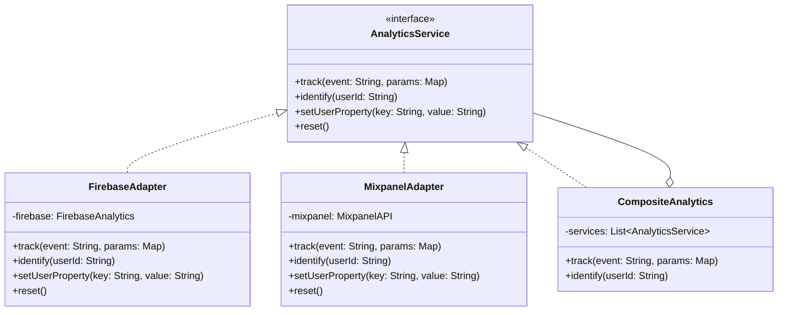

# Adapter Pattern

## Intent

Convert the interface of a class into another interface that clients expect. Adapter lets classes work together that couldn't otherwise because of incompatible interfaces. In mobile development, this is essential when integrating third-party SDKs, legacy APIs, or platform-specific services behind a unified interface.

## Problem

You're building an analytics system for your mobile app. You started with Firebase Analytics, but now marketing wants to add Mixpanel and Amplitude. Each SDK has a completely different API — different method names, parameter formats, and initialization flows. You can't modify these third-party SDKs, and you don't want your entire codebase coupled to any single analytics provider.

## Solution

Create a common interface that your app uses for analytics. Then create adapter classes that implement this interface by translating calls to each SDK's specific API. Your app code only knows about the common interface, making it trivial to swap or add analytics providers.

## UML Diagram



## Swift Implementation

```swift
import Foundation

// MARK: - Target Interface

protocol AnalyticsService {
    func track(event: String, parameters: [String: Any])
    func identify(userId: String)
    func setUserProperty(key: String, value: String)
    func reset()
}

// MARK: - Third-Party SDKs (Adaptees)

/// Simulates Firebase Analytics SDK
class FirebaseAnalytics {
    static let shared = FirebaseAnalytics()
    private init() {}

    func logEvent(_ name: String, parameters: [String: Any]?) {
        print("[Firebase] Event: \(name), params: \(parameters ?? [:])")
    }

    func setUserID(_ userID: String?) {
        print("[Firebase] UserID: \(userID ?? "nil")")
    }

    func setUserProperty(_ value: String?, forName name: String) {
        print("[Firebase] Property \(name) = \(value ?? "nil")")
    }

    func resetAnalyticsData() {
        print("[Firebase] Data reset")
    }
}

/// Simulates Mixpanel SDK
class MixpanelAPI {
    let token: String
    var distinctId: String?

    init(token: String) {
        self.token = token
    }

    func trackEvent(_ event: String, properties: [String: Any]?) {
        print("[Mixpanel] Track: \(event), props: \(properties ?? [:])")
    }

    func identifyUser(_ distinctId: String) {
        self.distinctId = distinctId
        print("[Mixpanel] Identify: \(distinctId)")
    }

    func registerSuperProperty(_ key: String, value: Any) {
        print("[Mixpanel] Super property: \(key) = \(value)")
    }

    func clearSuperProperties() {
        distinctId = nil
        print("[Mixpanel] Cleared")
    }
}

// MARK: - Adapters

final class FirebaseAnalyticsAdapter: AnalyticsService {
    private let firebase: FirebaseAnalytics

    init(firebase: FirebaseAnalytics = .shared) {
        self.firebase = firebase
    }

    func track(event: String, parameters: [String: Any]) {
        let sanitizedName = event
            .replacingOccurrences(of: " ", with: "_")
            .lowercased()
            .prefix(40)
        firebase.logEvent(String(sanitizedName), parameters: parameters)
    }

    func identify(userId: String) {
        firebase.setUserID(userId)
    }

    func setUserProperty(key: String, value: String) {
        firebase.setUserProperty(value, forName: key)
    }

    func reset() {
        firebase.setUserID(nil)
        firebase.resetAnalyticsData()
    }
}

final class MixpanelAnalyticsAdapter: AnalyticsService {
    private let mixpanel: MixpanelAPI

    init(token: String) {
        self.mixpanel = MixpanelAPI(token: token)
    }

    func track(event: String, parameters: [String: Any]) {
        var props = parameters
        props["source"] = "mobile_ios"
        mixpanel.trackEvent(event, properties: props)
    }

    func identify(userId: String) {
        mixpanel.identifyUser(userId)
    }

    func setUserProperty(key: String, value: String) {
        mixpanel.registerSuperProperty(key, value: value)
    }

    func reset() {
        mixpanel.clearSuperProperties()
    }
}

// MARK: - Composite Adapter (sends to all)

final class CompositeAnalyticsService: AnalyticsService {
    private var services: [AnalyticsService]

    init(services: [AnalyticsService]) {
        self.services = services
    }

    func addService(_ service: AnalyticsService) {
        services.append(service)
    }

    func track(event: String, parameters: [String: Any]) {
        services.forEach { $0.track(event: event, parameters: parameters) }
    }

    func identify(userId: String) {
        services.forEach { $0.identify(userId: userId) }
    }

    func setUserProperty(key: String, value: String) {
        services.forEach { $0.setUserProperty(key: key, value: value) }
    }

    func reset() {
        services.forEach { $0.reset() }
    }
}

// MARK: - Usage

let analytics = CompositeAnalyticsService(services: [
    FirebaseAnalyticsAdapter(),
    MixpanelAnalyticsAdapter(token: "mx-abc123"),
])

analytics.identify(userId: "user_42")
analytics.track(event: "purchase_completed", parameters: [
    "item": "premium_plan",
    "price": 9.99,
    "currency": "USD",
])
analytics.setUserProperty(key: "plan", value: "premium")
```

## Dart Implementation

```dart
// Target interface
abstract class AnalyticsService {
  void track(String event, Map<String, dynamic> parameters);
  void identify(String userId);
  void setUserProperty(String key, String value);
  void reset();
}

// Adaptee: Firebase
class FirebaseAnalytics {
  static final FirebaseAnalytics instance = FirebaseAnalytics._();
  FirebaseAnalytics._();

  void logEvent({required String name, Map<String, dynamic>? parameters}) {
    print('[Firebase] Event: $name, params: $parameters');
  }

  void setUserId({String? id}) {
    print('[Firebase] UserID: $id');
  }

  void setUserProperty({required String name, required String? value}) {
    print('[Firebase] Property $name = $value');
  }

  void resetAnalyticsData() {
    print('[Firebase] Data reset');
  }
}

// Adaptee: Mixpanel
class MixpanelAPI {
  final String token;
  String? distinctId;

  MixpanelAPI({required this.token});

  void trackEvent(String event, {Map<String, dynamic>? properties}) {
    print('[Mixpanel] Track: $event, props: $properties');
  }

  void identifyUser(String distinctId) {
    this.distinctId = distinctId;
    print('[Mixpanel] Identify: $distinctId');
  }

  void registerSuperProperty(String key, dynamic value) {
    print('[Mixpanel] Super property: $key = $value');
  }

  void clearSuperProperties() {
    distinctId = null;
    print('[Mixpanel] Cleared');
  }
}

// Adapters
class FirebaseAnalyticsAdapter implements AnalyticsService {
  final FirebaseAnalytics _firebase;

  FirebaseAnalyticsAdapter({FirebaseAnalytics? firebase})
      : _firebase = firebase ?? FirebaseAnalytics.instance;

  @override
  void track(String event, Map<String, dynamic> parameters) {
    final sanitized = event.replaceAll(' ', '_').toLowerCase();
    _firebase.logEvent(name: sanitized, parameters: parameters);
  }

  @override
  void identify(String userId) => _firebase.setUserId(id: userId);

  @override
  void setUserProperty(String key, String value) =>
      _firebase.setUserProperty(name: key, value: value);

  @override
  void reset() {
    _firebase.setUserId(id: null);
    _firebase.resetAnalyticsData();
  }
}

class MixpanelAnalyticsAdapter implements AnalyticsService {
  final MixpanelAPI _mixpanel;

  MixpanelAnalyticsAdapter({required String token})
      : _mixpanel = MixpanelAPI(token: token);

  @override
  void track(String event, Map<String, dynamic> parameters) {
    final props = {...parameters, 'source': 'mobile_flutter'};
    _mixpanel.trackEvent(event, properties: props);
  }

  @override
  void identify(String userId) => _mixpanel.identifyUser(userId);

  @override
  void setUserProperty(String key, String value) =>
      _mixpanel.registerSuperProperty(key, value);

  @override
  void reset() => _mixpanel.clearSuperProperties();
}

// Composite
class CompositeAnalyticsService implements AnalyticsService {
  final List<AnalyticsService> _services;

  CompositeAnalyticsService(this._services);

  void addService(AnalyticsService service) => _services.add(service);

  @override
  void track(String event, Map<String, dynamic> parameters) {
    for (final service in _services) {
      service.track(event, parameters);
    }
  }

  @override
  void identify(String userId) {
    for (final service in _services) {
      service.identify(userId);
    }
  }

  @override
  void setUserProperty(String key, String value) {
    for (final service in _services) {
      service.setUserProperty(key, value);
    }
  }

  @override
  void reset() {
    for (final service in _services) {
      service.reset();
    }
  }
}

// Usage
void main() {
  final analytics = CompositeAnalyticsService([
    FirebaseAnalyticsAdapter(),
    MixpanelAnalyticsAdapter(token: 'mx-abc123'),
  ]);

  analytics.identify('user_42');
  analytics.track('purchase_completed', {
    'item': 'premium_plan',
    'price': 9.99,
    'currency': 'USD',
  });
}
```

## TypeScript Implementation

```typescript
// Target interface
interface AnalyticsService {
  track(event: string, parameters: Record<string, unknown>): void;
  identify(userId: string): void;
  setUserProperty(key: string, value: string): void;
  reset(): void;
}

// Adaptee: Firebase
class FirebaseAnalytics {
  private static _instance: FirebaseAnalytics;
  static get instance(): FirebaseAnalytics {
    if (!this._instance) this._instance = new FirebaseAnalytics();
    return this._instance;
  }

  logEvent(name: string, parameters?: Record<string, unknown>): void {
    console.log(`[Firebase] Event: ${name}, params:`, parameters);
  }

  setUserId(id: string | null): void {
    console.log(`[Firebase] UserID: ${id}`);
  }

  setUserProperty(name: string, value: string | null): void {
    console.log(`[Firebase] Property ${name} = ${value}`);
  }

  resetAnalyticsData(): void {
    console.log("[Firebase] Data reset");
  }
}

// Adaptee: Mixpanel
class MixpanelAPI {
  distinctId?: string;

  constructor(public readonly token: string) {}

  trackEvent(event: string, properties?: Record<string, unknown>): void {
    console.log(`[Mixpanel] Track: ${event}, props:`, properties);
  }

  identifyUser(distinctId: string): void {
    this.distinctId = distinctId;
    console.log(`[Mixpanel] Identify: ${distinctId}`);
  }

  registerSuperProperty(key: string, value: unknown): void {
    console.log(`[Mixpanel] Super property: ${key} = ${value}`);
  }

  clearSuperProperties(): void {
    this.distinctId = undefined;
    console.log("[Mixpanel] Cleared");
  }
}

// Adapters
class FirebaseAnalyticsAdapter implements AnalyticsService {
  private firebase: FirebaseAnalytics;

  constructor(firebase?: FirebaseAnalytics) {
    this.firebase = firebase ?? FirebaseAnalytics.instance;
  }

  track(event: string, parameters: Record<string, unknown>): void {
    const sanitized = event.replace(/ /g, "_").toLowerCase();
    this.firebase.logEvent(sanitized, parameters);
  }

  identify(userId: string): void {
    this.firebase.setUserId(userId);
  }

  setUserProperty(key: string, value: string): void {
    this.firebase.setUserProperty(key, value);
  }

  reset(): void {
    this.firebase.setUserId(null);
    this.firebase.resetAnalyticsData();
  }
}

class MixpanelAnalyticsAdapter implements AnalyticsService {
  private mixpanel: MixpanelAPI;

  constructor(token: string) {
    this.mixpanel = new MixpanelAPI(token);
  }

  track(event: string, parameters: Record<string, unknown>): void {
    this.mixpanel.trackEvent(event, { ...parameters, source: "mobile_rn" });
  }

  identify(userId: string): void {
    this.mixpanel.identifyUser(userId);
  }

  setUserProperty(key: string, value: string): void {
    this.mixpanel.registerSuperProperty(key, value);
  }

  reset(): void {
    this.mixpanel.clearSuperProperties();
  }
}

// Composite
class CompositeAnalyticsService implements AnalyticsService {
  private services: AnalyticsService[];

  constructor(services: AnalyticsService[]) {
    this.services = [...services];
  }

  addService(service: AnalyticsService): void {
    this.services.push(service);
  }

  track(event: string, parameters: Record<string, unknown>): void {
    this.services.forEach((s) => s.track(event, parameters));
  }

  identify(userId: string): void {
    this.services.forEach((s) => s.identify(userId));
  }

  setUserProperty(key: string, value: string): void {
    this.services.forEach((s) => s.setUserProperty(key, value));
  }

  reset(): void {
    this.services.forEach((s) => s.reset());
  }
}

// Usage
const analytics = new CompositeAnalyticsService([
  new FirebaseAnalyticsAdapter(),
  new MixpanelAnalyticsAdapter("mx-abc123"),
]);

analytics.identify("user_42");
analytics.track("purchase_completed", {
  item: "premium_plan",
  price: 9.99,
  currency: "USD",
});
```

## When to Use

| Scenario | Adapter? | Reason |
|----------|---------|--------|
| Third-party SDK integration | ✅ | Decouple from vendor APIs |
| Legacy API migration | ✅ | New interface over old code |
| Cross-platform abstraction | ✅ | Unified API across platforms |
| Internal code you control | ❌ | Refactor directly instead |
| Performance-critical paths | ❌ | Extra indirection adds overhead |

## Real-World Examples

- **Alamofire/Dio wrappers**: Adapting HTTP libraries behind a common interface
- **Flutter plugins**: Platform channels adapting native APIs to Dart
- **Firebase SDKs**: Different native implementations behind unified API
- **React Native bridges**: Adapting native modules for JavaScript consumption
- **Payment SDKs**: Stripe, PayPal, Apple Pay behind a common `PaymentService`
