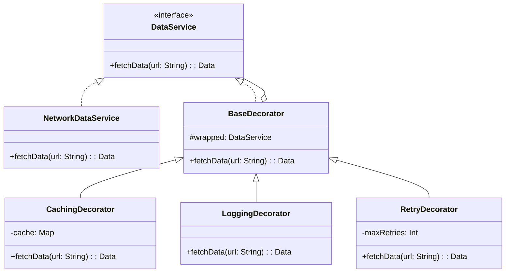

# Decorator Pattern

## Intent

Attach additional responsibilities to an object dynamically. Decorators provide a flexible alternative to subclassing for extending functionality. In mobile development, this pattern is perfect for adding logging, caching, authentication, or retry logic to services without modifying their core implementation.

## Problem

You have a network service that fetches data from an API. Now you need to add caching. Then logging. Then authentication header injection. Then retry logic. Each of these is a separate concern. Subclassing leads to a combinatorial explosion: `CachingLoggingAuthRetryNetworkService`. Modifying the original class violates the Single Responsibility Principle.

## Solution

Wrap the original service in decorator objects, each adding one piece of functionality. Each decorator implements the same interface as the wrapped object and delegates to it after (or before) adding its own behavior. Decorators can be stacked in any combination.

## UML Diagram



## Swift Implementation

```swift
import Foundation

// MARK: - Component Protocol

protocol APIService {
    func fetch(endpoint: String) async throws -> Data
}

// MARK: - Concrete Component

final class NetworkAPIService: APIService {
    private let session: URLSession
    private let baseURL: URL

    init(baseURL: URL, session: URLSession = .shared) {
        self.baseURL = baseURL
        self.session = session
    }

    func fetch(endpoint: String) async throws -> Data {
        let url = baseURL.appendingPathComponent(endpoint)
        let (data, response) = try await session.data(from: url)

        guard let http = response as? HTTPURLResponse,
              (200...299).contains(http.statusCode) else {
            throw APIError.requestFailed
        }

        return data
    }
}

enum APIError: Error {
    case requestFailed
    case cacheExpired
    case maxRetriesExceeded
}

// MARK: - Base Decorator

class APIServiceDecorator: APIService {
    let wrapped: APIService

    init(wrapping service: APIService) {
        self.wrapped = service
    }

    func fetch(endpoint: String) async throws -> Data {
        return try await wrapped.fetch(endpoint: endpoint)
    }
}

// MARK: - Logging Decorator

final class LoggingDecorator: APIServiceDecorator {
    private let logger: (String) -> Void

    init(wrapping service: APIService, logger: @escaping (String) -> Void = { print($0) }) {
        self.logger = logger
        super.init(wrapping: service)
    }

    override func fetch(endpoint: String) async throws -> Data {
        let start = CFAbsoluteTimeGetCurrent()
        logger("→ Request: \(endpoint)")

        do {
            let data = try await super.fetch(endpoint: endpoint)
            let elapsed = (CFAbsoluteTimeGetCurrent() - start) * 1000
            logger("← Response: \(endpoint) (\(data.count) bytes, \(String(format: "%.1f", elapsed))ms)")
            return data
        } catch {
            logger("✗ Error: \(endpoint) - \(error)")
            throw error
        }
    }
}

// MARK: - Caching Decorator

final class CachingDecorator: APIServiceDecorator {
    private struct CacheEntry {
        let data: Data
        let timestamp: Date
    }

    private var cache: [String: CacheEntry] = [:]
    private let ttl: TimeInterval

    init(wrapping service: APIService, ttl: TimeInterval = 300) {
        self.ttl = ttl
        super.init(wrapping: service)
    }

    override func fetch(endpoint: String) async throws -> Data {
        if let entry = cache[endpoint],
           Date().timeIntervalSince(entry.timestamp) < ttl {
            return entry.data
        }

        let data = try await super.fetch(endpoint: endpoint)
        cache[endpoint] = CacheEntry(data: data, timestamp: Date())
        return data
    }

    func invalidate(endpoint: String) {
        cache.removeValue(forKey: endpoint)
    }

    func invalidateAll() {
        cache.removeAll()
    }
}

// MARK: - Retry Decorator

final class RetryDecorator: APIServiceDecorator {
    private let maxRetries: Int
    private let delay: TimeInterval

    init(wrapping service: APIService, maxRetries: Int = 3, delay: TimeInterval = 1.0) {
        self.maxRetries = maxRetries
        self.delay = delay
        super.init(wrapping: service)
    }

    override func fetch(endpoint: String) async throws -> Data {
        var lastError: Error?

        for attempt in 0...maxRetries {
            do {
                return try await super.fetch(endpoint: endpoint)
            } catch {
                lastError = error
                if attempt < maxRetries {
                    let backoff = delay * pow(2.0, Double(attempt))
                    try await Task.sleep(nanoseconds: UInt64(backoff * 1_000_000_000))
                }
            }
        }

        throw lastError ?? APIError.maxRetriesExceeded
    }
}

// MARK: - Auth Decorator

final class AuthDecorator: APIServiceDecorator {
    private let tokenProvider: () -> String?

    init(wrapping service: APIService, tokenProvider: @escaping () -> String?) {
        self.tokenProvider = tokenProvider
        super.init(wrapping: service)
    }

    override func fetch(endpoint: String) async throws -> Data {
        // In a real scenario, you'd inject the token into the request
        guard tokenProvider() != nil else {
            throw APIError.requestFailed
        }
        return try await super.fetch(endpoint: endpoint)
    }
}

// MARK: - Usage (Stacking Decorators)

let baseURL = URL(string: "https://api.example.com")!

let service: APIService =
    LoggingDecorator(
        wrapping: RetryDecorator(
            wrapping: CachingDecorator(
                wrapping: NetworkAPIService(baseURL: baseURL),
                ttl: 60
            ),
            maxRetries: 3
        )
    )

Task {
    let data = try await service.fetch(endpoint: "/users")
    print("Received \(data.count) bytes")
}
```

## Dart Implementation

```dart
import 'dart:typed_data';

// Component interface
abstract class APIService {
  Future<Uint8List> fetch(String endpoint);
}

// Concrete component
class NetworkAPIService implements APIService {
  final String baseURL;

  NetworkAPIService({required this.baseURL});

  @override
  Future<Uint8List> fetch(String endpoint) async {
    print('  [Network] Fetching $baseURL$endpoint');
    // Simulated network response
    await Future.delayed(const Duration(milliseconds: 100));
    return Uint8List.fromList('{"status":"ok"}'.codeUnits);
  }
}

// Base decorator
abstract class APIServiceDecorator implements APIService {
  final APIService wrapped;
  APIServiceDecorator(this.wrapped);

  @override
  Future<Uint8List> fetch(String endpoint) => wrapped.fetch(endpoint);
}

// Logging decorator
class LoggingDecorator extends APIServiceDecorator {
  final void Function(String) logger;

  LoggingDecorator(super.wrapped, {void Function(String)? logger})
      : logger = logger ?? print;

  @override
  Future<Uint8List> fetch(String endpoint) async {
    final stopwatch = Stopwatch()..start();
    logger('→ Request: $endpoint');

    try {
      final data = await super.fetch(endpoint);
      stopwatch.stop();
      logger('← Response: $endpoint (${data.length} bytes, ${stopwatch.elapsedMilliseconds}ms)');
      return data;
    } catch (e) {
      logger('✗ Error: $endpoint - $e');
      rethrow;
    }
  }
}

// Caching decorator
class CachingDecorator extends APIServiceDecorator {
  final Map<String, _CacheEntry> _cache = {};
  final Duration ttl;

  CachingDecorator(super.wrapped, {this.ttl = const Duration(minutes: 5)});

  @override
  Future<Uint8List> fetch(String endpoint) async {
    final entry = _cache[endpoint];
    if (entry != null && DateTime.now().difference(entry.timestamp) < ttl) {
      print('  [Cache] Hit: $endpoint');
      return entry.data;
    }

    print('  [Cache] Miss: $endpoint');
    final data = await super.fetch(endpoint);
    _cache[endpoint] = _CacheEntry(data: data, timestamp: DateTime.now());
    return data;
  }

  void invalidate(String endpoint) => _cache.remove(endpoint);
  void invalidateAll() => _cache.clear();
}

class _CacheEntry {
  final Uint8List data;
  final DateTime timestamp;
  _CacheEntry({required this.data, required this.timestamp});
}

// Retry decorator
class RetryDecorator extends APIServiceDecorator {
  final int maxRetries;
  final Duration delay;

  RetryDecorator(super.wrapped, {this.maxRetries = 3, this.delay = const Duration(seconds: 1)});

  @override
  Future<Uint8List> fetch(String endpoint) async {
    Object? lastError;

    for (var attempt = 0; attempt <= maxRetries; attempt++) {
      try {
        return await super.fetch(endpoint);
      } catch (e) {
        lastError = e;
        if (attempt < maxRetries) {
          final backoff = delay * (1 << attempt);
          await Future.delayed(backoff);
        }
      }
    }

    throw lastError ?? Exception('Max retries exceeded');
  }
}

// Usage
void main() async {
  final service = LoggingDecorator(
    RetryDecorator(
      CachingDecorator(
        NetworkAPIService(baseURL: 'https://api.example.com'),
        ttl: const Duration(seconds: 60),
      ),
      maxRetries: 3,
    ),
  );

  final data = await service.fetch('/users');
  print('Received ${data.length} bytes');

  // Second call hits cache
  final cached = await service.fetch('/users');
  print('Cached: ${cached.length} bytes');
}
```

## TypeScript Implementation

```typescript
// Component interface
interface APIService {
  fetch(endpoint: string): Promise<Uint8Array>;
}

// Concrete component
class NetworkAPIService implements APIService {
  constructor(private readonly baseURL: string) {}

  async fetch(endpoint: string): Promise<Uint8Array> {
    console.log(`  [Network] Fetching ${this.baseURL}${endpoint}`);
    const response = await globalThis.fetch(`${this.baseURL}${endpoint}`);
    const buffer = await response.arrayBuffer();
    return new Uint8Array(buffer);
  }
}

// Logging decorator
class LoggingDecorator implements APIService {
  constructor(
    private readonly wrapped: APIService,
    private readonly logger: (msg: string) => void = console.log
  ) {}

  async fetch(endpoint: string): Promise<Uint8Array> {
    const start = performance.now();
    this.logger(`→ Request: ${endpoint}`);

    try {
      const data = await this.wrapped.fetch(endpoint);
      const elapsed = (performance.now() - start).toFixed(1);
      this.logger(`← Response: ${endpoint} (${data.length} bytes, ${elapsed}ms)`);
      return data;
    } catch (error) {
      this.logger(`✗ Error: ${endpoint} - ${error}`);
      throw error;
    }
  }
}

// Caching decorator
interface CacheEntry {
  data: Uint8Array;
  timestamp: number;
}

class CachingDecorator implements APIService {
  private cache = new Map<string, CacheEntry>();

  constructor(
    private readonly wrapped: APIService,
    private readonly ttlMs: number = 300_000
  ) {}

  async fetch(endpoint: string): Promise<Uint8Array> {
    const entry = this.cache.get(endpoint);
    if (entry && Date.now() - entry.timestamp < this.ttlMs) {
      console.log(`  [Cache] Hit: ${endpoint}`);
      return entry.data;
    }

    console.log(`  [Cache] Miss: ${endpoint}`);
    const data = await this.wrapped.fetch(endpoint);
    this.cache.set(endpoint, { data, timestamp: Date.now() });
    return data;
  }

  invalidate(endpoint: string): void {
    this.cache.delete(endpoint);
  }

  invalidateAll(): void {
    this.cache.clear();
  }
}

// Retry decorator
class RetryDecorator implements APIService {
  constructor(
    private readonly wrapped: APIService,
    private readonly maxRetries: number = 3,
    private readonly delayMs: number = 1000
  ) {}

  async fetch(endpoint: string): Promise<Uint8Array> {
    let lastError: unknown;

    for (let attempt = 0; attempt <= this.maxRetries; attempt++) {
      try {
        return await this.wrapped.fetch(endpoint);
      } catch (error) {
        lastError = error;
        if (attempt < this.maxRetries) {
          const backoff = this.delayMs * Math.pow(2, attempt);
          await new Promise((r) => setTimeout(r, backoff));
        }
      }
    }

    throw lastError ?? new Error("Max retries exceeded");
  }
}

// Usage
const service: APIService = new LoggingDecorator(
  new RetryDecorator(
    new CachingDecorator(
      new NetworkAPIService("https://api.example.com"),
      60_000
    ),
    3
  )
);

service.fetch("/users").then((data) => {
  console.log(`Received ${data.length} bytes`);
});
```

## When to Use

| Scenario | Decorator? | Reason |
|----------|-----------|--------|
| Adding caching to a service | ✅ | Transparent caching layer |
| Adding logging/metrics | ✅ | Cross-cutting concern |
| Retry logic | ✅ | Stackable behavior |
| Complex inheritance hierarchies | ✅ | Composition over inheritance |
| Simple objects | ❌ | Over-engineering |
| Performance-critical hot paths | ❌ | Indirection overhead |

## Real-World Examples

- **NSInputStream/NSOutputStream** in Foundation: Decorated streams
- **Alamofire's `RequestInterceptor`**: Chained request/response modification
- **Dio interceptors** in Dart: Logging, auth, retry as stackable interceptors
- **Express.js middleware**: Each middleware decorates the request pipeline
- **Flutter's `Widget` wrapping**: Padding, Center, Container as visual decorators
