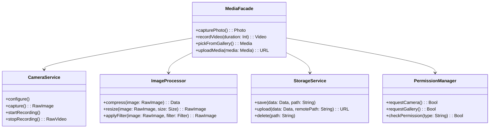

# Facade Pattern

## Intent

Provide a unified interface to a set of interfaces in a subsystem. Facade defines a higher-level interface that makes the subsystem easier to use. In mobile development, facades simplify complex SDK interactions like media playback, authentication flows, or payment processing.

## Problem

Modern mobile apps integrate dozens of subsystems: camera, photo library, image processing, file system, cloud storage. Each has its own API with specific initialization, configuration, error handling, and cleanup requirements. Client code that deals with all these subsystems directly becomes deeply coupled and fragile.

## Solution

Create a facade class that provides simple methods for common operations, internally coordinating all the subsystem interactions. The facade doesn't replace the subsystems — it just provides a convenient shortcut for the most common use cases.

## UML Diagram



## Swift Implementation

```swift
import Foundation

// MARK: - Subsystem Classes

final class CameraService {
    enum CameraError: Error {
        case notAvailable, captureFailed, recordingFailed
    }

    func configure(resolution: String, position: String) {
        print("Camera configured: \(resolution), \(position)")
    }

    func capture() throws -> Data {
        print("Capturing photo...")
        return Data(repeating: 0xFF, count: 1024)
    }

    func startRecording() {
        print("Recording started")
    }

    func stopRecording() throws -> Data {
        print("Recording stopped")
        return Data(repeating: 0xAA, count: 4096)
    }

    func cleanup() {
        print("Camera resources released")
    }
}

final class ImageProcessor {
    func compress(_ data: Data, quality: Double) -> Data {
        let compressed = Int(Double(data.count) * quality)
        print("Compressed: \(data.count) → \(compressed) bytes")
        return Data(repeating: 0xBB, count: compressed)
    }

    func resize(_ data: Data, width: Int, height: Int) -> Data {
        print("Resized to \(width)x\(height)")
        return data
    }

    func applyFilter(_ data: Data, filter: String) -> Data {
        print("Applied filter: \(filter)")
        return data
    }

    func generateThumbnail(_ data: Data, size: Int) -> Data {
        print("Generated \(size)x\(size) thumbnail")
        return Data(repeating: 0xCC, count: size * size)
    }
}

final class StorageService {
    enum StorageError: Error {
        case saveFailed, uploadFailed, notFound
    }

    func saveLocally(_ data: Data, filename: String) throws -> String {
        let path = "/documents/\(filename)"
        print("Saved to \(path) (\(data.count) bytes)")
        return path
    }

    func upload(_ data: Data, remotePath: String) async throws -> URL {
        print("Uploading \(data.count) bytes to \(remotePath)...")
        try await Task.sleep(nanoseconds: 100_000_000)
        return URL(string: "https://cdn.example.com/\(remotePath)")!
    }

    func delete(path: String) throws {
        print("Deleted: \(path)")
    }
}

final class PermissionManager {
    enum Permission {
        case camera, photoLibrary, microphone
    }

    private var granted: Set<Permission> = []

    func request(_ permission: Permission) async -> Bool {
        print("Requesting \(permission) permission...")
        granted.insert(permission)
        return true
    }

    func check(_ permission: Permission) -> Bool {
        return granted.contains(permission)
    }
}

// MARK: - Facade

final class MediaFacade {
    private let camera = CameraService()
    private let processor = ImageProcessor()
    private let storage = StorageService()
    private let permissions = PermissionManager()

    struct PhotoResult {
        let localPath: String
        let remoteURL: URL
        let thumbnailPath: String
    }

    func captureAndUploadPhoto(
        resolution: String = "high",
        quality: Double = 0.8,
        filter: String? = nil
    ) async throws -> PhotoResult {
        // 1. Check permissions
        guard await permissions.request(.camera) else {
            throw MediaError.permissionDenied
        }

        // 2. Configure and capture
        camera.configure(resolution: resolution, position: "back")
        var imageData = try camera.capture()

        // 3. Process
        if let filter = filter {
            imageData = processor.applyFilter(imageData, filter: filter)
        }
        imageData = processor.compress(imageData, quality: quality)
        let thumbnail = processor.generateThumbnail(imageData, size: 150)

        // 4. Save locally
        let timestamp = Int(Date().timeIntervalSince1970)
        let localPath = try storage.saveLocally(imageData, filename: "photo_\(timestamp).jpg")
        let thumbPath = try storage.saveLocally(thumbnail, filename: "thumb_\(timestamp).jpg")

        // 5. Upload
        let remoteURL = try await storage.upload(imageData, remotePath: "photos/\(timestamp).jpg")

        // 6. Cleanup
        camera.cleanup()

        return PhotoResult(localPath: localPath, remoteURL: remoteURL, thumbnailPath: thumbPath)
    }

    func pickAndUploadFromGallery() async throws -> URL {
        guard await permissions.request(.photoLibrary) else {
            throw MediaError.permissionDenied
        }

        // Simulate gallery pick
        let imageData = Data(repeating: 0xDD, count: 2048)
        let compressed = processor.compress(imageData, quality: 0.7)
        let timestamp = Int(Date().timeIntervalSince1970)
        let url = try await storage.upload(compressed, remotePath: "gallery/\(timestamp).jpg")
        return url
    }

    enum MediaError: Error {
        case permissionDenied
        case processingFailed
    }
}

// MARK: - Usage

let media = MediaFacade()

Task {
    do {
        let result = try await media.captureAndUploadPhoto(
            quality: 0.85,
            filter: "vintage"
        )
        print("Photo uploaded: \(result.remoteURL)")
        print("Local: \(result.localPath)")
    } catch {
        print("Failed: \(error)")
    }
}
```

## Dart Implementation

```dart
import 'dart:typed_data';

// Subsystem classes
class CameraService {
  void configure({String resolution = 'high', String position = 'back'}) {
    print('Camera configured: $resolution, $position');
  }

  Uint8List capture() {
    print('Capturing photo...');
    return Uint8List.fromList(List.filled(1024, 0xFF));
  }

  void startRecording() => print('Recording started');

  Uint8List stopRecording() {
    print('Recording stopped');
    return Uint8List.fromList(List.filled(4096, 0xAA));
  }

  void cleanup() => print('Camera resources released');
}

class ImageProcessor {
  Uint8List compress(Uint8List data, {double quality = 0.8}) {
    final size = (data.length * quality).toInt();
    print('Compressed: ${data.length} → $size bytes');
    return Uint8List.fromList(List.filled(size, 0xBB));
  }

  Uint8List resize(Uint8List data, {required int width, required int height}) {
    print('Resized to ${width}x$height');
    return data;
  }

  Uint8List applyFilter(Uint8List data, String filter) {
    print('Applied filter: $filter');
    return data;
  }

  Uint8List generateThumbnail(Uint8List data, {int size = 150}) {
    print('Generated ${size}x$size thumbnail');
    return Uint8List.fromList(List.filled(size * size, 0xCC));
  }
}

class StorageService {
  String saveLocally(Uint8List data, String filename) {
    final path = '/documents/$filename';
    print('Saved to $path (${data.length} bytes)');
    return path;
  }

  Future<Uri> upload(Uint8List data, String remotePath) async {
    print('Uploading ${data.length} bytes to $remotePath...');
    await Future.delayed(const Duration(milliseconds: 100));
    return Uri.parse('https://cdn.example.com/$remotePath');
  }

  void delete(String path) => print('Deleted: $path');
}

enum Permission { camera, photoLibrary, microphone }

class PermissionManager {
  final Set<Permission> _granted = {};

  Future<bool> request(Permission permission) async {
    print('Requesting $permission permission...');
    _granted.add(permission);
    return true;
  }

  bool check(Permission permission) => _granted.contains(permission);
}

// Facade
class PhotoResult {
  final String localPath;
  final Uri remoteURL;
  final String thumbnailPath;

  PhotoResult({
    required this.localPath,
    required this.remoteURL,
    required this.thumbnailPath,
  });
}

class MediaFacade {
  final _camera = CameraService();
  final _processor = ImageProcessor();
  final _storage = StorageService();
  final _permissions = PermissionManager();

  Future<PhotoResult> captureAndUploadPhoto({
    String resolution = 'high',
    double quality = 0.8,
    String? filter,
  }) async {
    if (!await _permissions.request(Permission.camera)) {
      throw Exception('Camera permission denied');
    }

    _camera.configure(resolution: resolution);
    var imageData = _camera.capture();

    if (filter != null) {
      imageData = _processor.applyFilter(imageData, filter);
    }
    imageData = _processor.compress(imageData, quality: quality);
    final thumbnail = _processor.generateThumbnail(imageData);

    final timestamp = DateTime.now().millisecondsSinceEpoch;
    final localPath = _storage.saveLocally(imageData, 'photo_$timestamp.jpg');
    final thumbPath = _storage.saveLocally(thumbnail, 'thumb_$timestamp.jpg');
    final remoteURL = await _storage.upload(imageData, 'photos/$timestamp.jpg');

    _camera.cleanup();

    return PhotoResult(
      localPath: localPath,
      remoteURL: remoteURL,
      thumbnailPath: thumbPath,
    );
  }

  Future<Uri> pickAndUploadFromGallery() async {
    if (!await _permissions.request(Permission.photoLibrary)) {
      throw Exception('Gallery permission denied');
    }

    final imageData = Uint8List.fromList(List.filled(2048, 0xDD));
    final compressed = _processor.compress(imageData, quality: 0.7);
    final timestamp = DateTime.now().millisecondsSinceEpoch;
    return _storage.upload(compressed, 'gallery/$timestamp.jpg');
  }
}

// Usage
void main() async {
  final media = MediaFacade();

  final result = await media.captureAndUploadPhoto(
    quality: 0.85,
    filter: 'vintage',
  );
  print('Uploaded: ${result.remoteURL}');
  print('Local: ${result.localPath}');
}
```

## TypeScript Implementation

```typescript
// Subsystem classes
class CameraService {
  configure(resolution: string = "high", position: string = "back"): void {
    console.log(`Camera configured: ${resolution}, ${position}`);
  }

  capture(): Uint8Array {
    console.log("Capturing photo...");
    return new Uint8Array(1024).fill(0xff);
  }

  startRecording(): void { console.log("Recording started"); }

  stopRecording(): Uint8Array {
    console.log("Recording stopped");
    return new Uint8Array(4096).fill(0xaa);
  }

  cleanup(): void { console.log("Camera resources released"); }
}

class ImageProcessor {
  compress(data: Uint8Array, quality: number = 0.8): Uint8Array {
    const size = Math.floor(data.length * quality);
    console.log(`Compressed: ${data.length} → ${size} bytes`);
    return new Uint8Array(size).fill(0xbb);
  }

  resize(data: Uint8Array, width: number, height: number): Uint8Array {
    console.log(`Resized to ${width}x${height}`);
    return data;
  }

  applyFilter(data: Uint8Array, filter: string): Uint8Array {
    console.log(`Applied filter: ${filter}`);
    return data;
  }

  generateThumbnail(data: Uint8Array, size: number = 150): Uint8Array {
    console.log(`Generated ${size}x${size} thumbnail`);
    return new Uint8Array(size * size).fill(0xcc);
  }
}

class StorageService {
  saveLocally(data: Uint8Array, filename: string): string {
    const path = `/documents/${filename}`;
    console.log(`Saved to ${path} (${data.length} bytes)`);
    return path;
  }

  async upload(data: Uint8Array, remotePath: string): Promise<string> {
    console.log(`Uploading ${data.length} bytes to ${remotePath}...`);
    await new Promise((r) => setTimeout(r, 100));
    return `https://cdn.example.com/${remotePath}`;
  }

  delete(path: string): void { console.log(`Deleted: ${path}`); }
}

type Permission = "camera" | "photoLibrary" | "microphone";

class PermissionManager {
  private granted = new Set<Permission>();

  async request(permission: Permission): Promise<boolean> {
    console.log(`Requesting ${permission} permission...`);
    this.granted.add(permission);
    return true;
  }

  check(permission: Permission): boolean {
    return this.granted.has(permission);
  }
}

// Facade
interface PhotoResult {
  localPath: string;
  remoteURL: string;
  thumbnailPath: string;
}

class MediaFacade {
  private camera = new CameraService();
  private processor = new ImageProcessor();
  private storage = new StorageService();
  private permissions = new PermissionManager();

  async captureAndUploadPhoto(options: {
    resolution?: string;
    quality?: number;
    filter?: string;
  } = {}): Promise<PhotoResult> {
    const { resolution = "high", quality = 0.8, filter } = options;

    if (!(await this.permissions.request("camera"))) {
      throw new Error("Camera permission denied");
    }

    this.camera.configure(resolution);
    let imageData = this.camera.capture();

    if (filter) {
      imageData = this.processor.applyFilter(imageData, filter);
    }
    imageData = this.processor.compress(imageData, quality);
    const thumbnail = this.processor.generateThumbnail(imageData);

    const timestamp = Date.now();
    const localPath = this.storage.saveLocally(imageData, `photo_${timestamp}.jpg`);
    const thumbPath = this.storage.saveLocally(thumbnail, `thumb_${timestamp}.jpg`);
    const remoteURL = await this.storage.upload(imageData, `photos/${timestamp}.jpg`);

    this.camera.cleanup();

    return { localPath, remoteURL, thumbnailPath: thumbPath };
  }

  async pickAndUploadFromGallery(): Promise<string> {
    if (!(await this.permissions.request("photoLibrary"))) {
      throw new Error("Gallery permission denied");
    }

    const imageData = new Uint8Array(2048).fill(0xdd);
    const compressed = this.processor.compress(imageData, 0.7);
    return this.storage.upload(compressed, `gallery/${Date.now()}.jpg`);
  }
}

// Usage
const media = new MediaFacade();

media.captureAndUploadPhoto({ quality: 0.85, filter: "vintage" }).then((result) => {
  console.log(`Uploaded: ${result.remoteURL}`);
  console.log(`Local: ${result.localPath}`);
});
```

## When to Use

| Scenario | Facade? | Reason |
|----------|---------|--------|
| Complex SDK with many subsystems | ✅ | Simplify common workflows |
| Media capture + process + upload | ✅ | Coordinate multiple services |
| Authentication flows | ✅ | Token refresh + validation + storage |
| Simple, single-purpose service | ❌ | Unnecessary abstraction |
| Need fine-grained control | ❌ | Facade hides details you might need |

## Real-World Examples

- **AVFoundation wrappers** in iOS: Simplifying camera/audio capture
- **Firebase Auth** facade: Wraps OAuth, email, phone auth behind one API
- **Flutter's `ImagePicker`**: Facade over camera/gallery subsystems
- **Stripe SDK**: Payment processing facade over tokenization, validation, processing
- **CoreData stack setup**: Facade for persistent container, context, and store coordination
